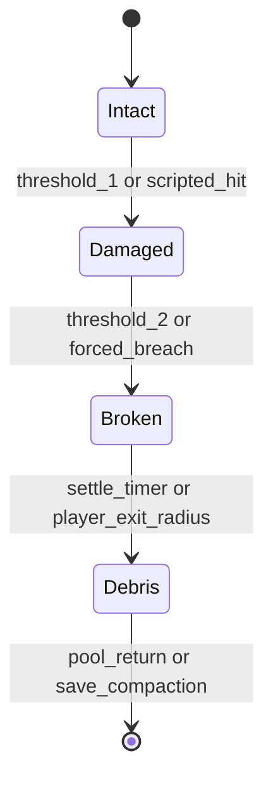

             Genisis Protocol 

     By Serob, Samvelovich Cholakyan.

Genesis Protocol now has a data-driven campaign spine connecting the first playable mission to the larger world map, combat progression, and a persistent player profile.

## Mission chain

1. **Bel Air Blackout** — Bel Air Blackout Zone → unlocks `salt_circle`.

2. **Irvine Consensus** — Irvine Suburbs → unlocks `cold_storage`.

3. **Dark Pool Descent** — Dark Pool Dungeons.

4. **Zero-State Relay** — Zero-State Relay Towers → awards `genesis_core`.

`data/missions/campaign.json` is the source of truth for mission IDs, regions, unlock dependencies, forward progression, and rewards.


                 ## Runtime behavior

`src/campaign.py` loads the mission graph and provides:

- `is_unlocked()` for gating.
- `available()` for mission selection UI.
- `complete_mission()` for persistent campaign progression.
- `rewards_for()` for post-mission reward handoff.
- `grant_rewards()` for applying earned combat rewards to a loadout.
- `next_mission()` for the post-mission handoff.

`src/loadout.py` consumes ability IDs from the combat registry and provides a stable progression boundary: 
new campaigns begin with `packet_burn`, while mission rewards can unlock additional combat abilities.


       ## Persistent player profile


`src/profile.py` provides `CampaignProfile`, the long-lived player state shared across missions. It carries:

- `PlayerProgression` level, XP, and unspent upgrade points.
- `PlayerUpgrades` purchased health, hashrate, and corruption-resistance bonuses.
- `AbilityLoadout` combat abilities earned through campaign rewards.
- mission-earned health, hashrate, corruption, evidence, reputation, choices, and inventory.

`CampaignProfile.save()` and `CampaignProfile.load()` provide JSON persistence so the same character can leave one mission and resume the next without resetting progression or unlocked abilities.

Before each mission, `mission_player()` refreshes upgrade bonuses and returns the shared `PlayerState`. Campaign rewards are then applied to the same profile, keeping combat unlocks and inventory available for subsequent missions.


                  ## Player XP

`PlayerProgression` keeps persistent level progression independently of the renderer. Players begin at level 1 with a 100-XP first threshold. Each subsequent threshold increases by 50 XP. XP rolls over after a level-up, and every level gained awards one upgrade point. Negative XP is rejected.


           ## Character upgrades


`PlayerUpgrades` converts earned upgrade points into persistent bonuses:

- `max_health` → +10 maximum health per point
- `hashrate` → +5 hashrate per point
- `corruption_resistance` → persistent resistance rating for future combat integration.
Upgrades are serialized with the profile and re-applied whenever a mission begins.

These layers remain renderer- and engine-neutral so they can later drive Android/Vulkan UI, world streaming, save slots, or another front-end without rewriting mission rules.


   # Combat Loadout Progression

`src/loadout.py` provides the progression layer between campaign rewards and tactical combat abilities.


        
                  ## Starting kit


Every new loadout begins with **Packet Burn**. The player can use it immediately in the tactical combat system.


            ## Unlocking abilities


The loadout currently supports three combat abilities:

| Ability | Initial state | Role |
|---|---|---|
| Packet Burn | Unlocked | Reliable digital damage |
| Salt Circle | Locked | Occult damage with corruption tradeoff |
| Cold Storage | Locked | Void damage and dead-wallet theming |

`unlock()` validates ability IDs against `src/combat.py`, so progression cannot silently create invalid combat actions. `require()` gives mission/UI code an explicit lock failure, while `available()` returns abilities in the stable data-definition order.


                ## Persistence

`to_dict()` and `from_dict()` provide a small engine-neutral serialization boundary. Unknown ability IDs are rejected during restore rather than being silently accepted.

The next campaign layer can award `salt_circle` or `cold_storage` from mission rewards without changing the combat resolver itself.


       # Tactical Combat Progression


The combat layer provides deterministic ability execution with progression-aware loadouts.

| Core abilities |

| Ability | Type | Damage | Cooldown | Corruption gain |
| --- | --- | ---: | ---: | ---: |
| Packet Burn | Digital | 28 | 2 turns | 0 |
| Salt Circle | Occult | 18 | 3 turns | 5 |
| Cold Storage | Void | 12 | 4 turns | 8 |

Basic attacks advance all cooldowns. Using an ability advances the turn and starts that ability's cooldown while ticking the others.

| Unlock progression |

A new loadout begins with `packet_burn`. Campaign rewards unlock additional abilities:

- **Bel Air Blackout** → `salt_circle`
- **Irvine Consensus** → `cold_storage`
- **Dark Pool Descent** → no combat ability reward
- **Zero-State Relay** → `genesis_core` inventory reward

Locked abilities are rejected before combat damage is applied. Loadouts serialize only stable ability IDs, keeping progression compatible with a future Android/Vulkan front end.

## Character upgrades

Level-up points are persistent across the campaign and can be spent at an in-world `UpgradeStation` safe node. The station exposes three stable upgrade IDs:

- `max_health` — **Hardened Frame**: +10 maximum health per point
- `hashrate` — **Hotter Hash**: +5 hashrate per point
- `corruption_resistance` — **Salted Core**: reduce corruption gained from abilities by 1 per point

Purchased upgrades are applied immediately to the persistent `CampaignProfile` and survive profile save/load. Combat accepts the resulting corruption-resistance value so high-risk abilities become progressively safer without changing their damage balance.

## Design intent

The system is deterministic and engine-neutral: the same inputs always produce the same damage, cooldown, and corruption state. Corruption is a combat consequence for high-risk abilities, while character upgrades give players a controlled way to invest level-up points into survivability, throughput, or resistance.

The data definitions in `data/gameplay/abilities.json` mirror the runtime ability IDs and balance values.

# Dark Pool Descent

The third campaign mission moves Genesis Protocol beneath the surface into the **Dark Pool Dungeons**.

## Objective spine

1. Descend into the Dark Pool dungeons.
2. Locate the Blackwater Choir signal and scan its corrupted Merkle root.
3. Fight the Dark Pool Warden and recover a corrupted chain fragment.
4. Decode the submerged chain liturgy with the Genesis key.
5. Choose Cleanse, Exploit, or Quarantine.
6. Escape through the flooded service shaft.

## Runtime behavior

`src/darkpool.py` keeps the mission engine-neutral while reusing the shared `GameState`, `Encounter`, choice consequences, and Merkle investigation mechanics. The Warden has 60 health, deals 14 damage per exchange, and adds 8 corruption on each hit.

Completing `dark_pool_descent` unlocks `zero_state_relay` through `data/missions/campaign.json`.

# Bitcoin Billionaire's Demonic Haunting — Game Design

## High Concept
A techno-horror action RPG about a cryptocurrency billionaire possessed by a demonic intelligence that awakened inside the Bitcoin genesis block. Players infiltrate haunted networks, survive spectral market events, and purge corrupted nodes before the entity takes permanent control of the global financial grid.

## Pillars
- **Digital occult horror:** Rituals, sigils, and hauntings manifest through terminals, wallets, ledgers, and abandoned server farms.
- **Action RPG survival:** Fast encounters against glitch spirits, market wraiths, and possessed machines are balanced by scarce resources.
- **Investigation and decoding:** Players inspect corrupted logs, solve cryptographic puzzles, and reconstruct the demon's origin.
- **Moral economy:** Choices about wealth, privacy, and power change endings and NPC trust.


               ## Core Loop

1. Receive a haunting signal from a compromised wallet, exchange, mansion room, or mining facility.
2. Explore the physical/digital site for evidence, keys, and ritual fragments.
3. Fight or evade spectral algorithms and possessed security systems.
4. Decode a corrupted chain segment to reveal lore or unlock upgrades.
5. Decide whether to cleanse, exploit, or quarantine the asset.
6. Return to a safe node to craft tools, upgrade abilities, and choose the next breach.


                 ## Player Fantasy

The player is a paranormal cryptographer: part exorcist, part hacker, part monster hunter. Their tools feel improvised and dangerous, combining hardware wallets, salt circles, cold-storage reliquaries, packet sniffers, and blessed ASIC rigs.

# Genesis Protocol: Complete Android Game and Asset Production Specification

## 1. Executive Summary

**Genesis Protocol** is a third-person techno-horror action RPG for Android set after a rogue entity, the Genesis Spark, emerges from corrupted proof-of-work residue and possesses a Bitcoin billionaire whose smart-grid empire becomes a planetary haunting machine. The game fuses the **Genesis Protocol** systems canon—Cypherpunk, Digital Wraith, Grid Vanguard, Code Weaver, Merkle Tree progression, Hashrate scaling, Faraday Forge crafting, Anti-Gravity Studio traversal fabrication, Mnemonic Board seed phrases, Sybil Invasions, Dark Pool Dungeons, Zero-State Relays, Overflow Arena, PvP Siphon Protocol, Developer Console identity, and Recluse Chronicles seasons—with the narrative canon of **Bitcoin Billionaire's Demonic Haunting**: haunted wealth, demonized infrastructure, psychological dread, corrupted networks, spectral algorithms, and environments where suburban quiet and financial power rot into digital possession.

The production target is a premium-feeling Android action adventure with:

- **Native C++ Android NDK engine core** for deterministic gameplay, ECS, physics integration, procedural dungeons, destructibility, and save serialization.
- **Vulkan renderer** optimized for tile-based mobile GPUs, clustered forward+ lighting, GPU-driven culling, streaming terrain tiles, PBR materials, temporal upscaling, and ARCore camera composition.
- **Jetpack Compose shell UI** for menus, HUD overlays, inventory, Merkle skill visualization, Darknet Bazaar, Developer Console identity, accessibility, and settings.
- **Media3 + ExoPlayer audio layer** for seamless atmospheric loops, adaptive combat music, audiobook lore chapters, modem screams, server-fan hum, and boss telegraphs.
- **Room DB + encrypted file blobs** for offline saves, character builds, world state, codex unlocks, replayable dungeons, and season progress.
- **WorkManager daemon simulation** for asynchronous world events, mining-daemon invasions, bazaar rotations, and offline Hashrate simulations.
- **Kotlin coroutines** for UI event streams, combat scheduling, network status, audio crossfades, and ECS bridge messages.
- **ARCore GeoScan Matrix overlays** that project hidden signal geometry, subsurface entrances, haunt signatures, and Zero-State tower anomalies into real-world camera views.

The shipped game is structured into four campaign acts, nine major regions, four classes, seven loot tiers, deterministic procedural endgame activities, optional PvP invasions, and a complete realistic-stylized art pipeline with warm terracotta accents, muted teal complements, and deep neutral bases.

## 2. Engine Architecture

### 2.1 Android Module Layout

```text
GenesisProtocol/
  app/                                # Android application shell
    src/main/AndroidManifest.xml
    src/main/java/com/genesisprotocol/
      MainActivity.kt                 # Compose + Surface host
      ui/                             # Compose screens and HUD overlays
      audio/                          # Media3 managers
      ar/                             # ARCore GeoScan session bridge
      data/                           # Room entities, DAO, repositories
      worker/                         # WorkManager daemon jobs
      net/                            # PvP and event network clients
    src/main/cpp/
      engine/                         # C++ game engine
      renderer/vulkan/                # Vulkan backend
      ecs/                            # Entity-component system
      gameplay/                       # Combat, skills, loot, Merkle compiler
      world/                          # Streaming, procedural dungeon generation
      physics/                        # Character controller + destruction
      save/                           # Deterministic state serialization
      audio_bridge/                   # Native event emitter to Kotlin audio
  assets/
    bundles/                          # Packed world, character, audio assets
    shaders/                          # SPIR-V output
    metadata/asset_manifest.json
  docs/
    genesis_protocol_complete_spec.md
    art_asset_pipeline.md
```

### 2.2 Runtime Layering

| Layer | Language | Responsibility | Threading |
|---|---|---|---|
| Android Shell | Kotlin | lifecycle, permissions, Compose UI, Room, WorkManager, Media3, ARCore | main + coroutine dispatchers |
| Engine Bridge | JNI/C API | binary command queues between Kotlin and C++ | lock-free queues |
| Core Engine | C++20 | ECS, fixed-step simulation, combat, skills, save graph | simulation thread |
| Renderer | C++20/Vulkan | frame graph, PBR, particles, UI composition surface | render thread |
| IO/Streaming | C++20 + Kotlin | asset bundles, terrain tiles, texture mips, async save | IO pool |
| Network | Kotlin + C++ validation | PvP session orchestration, anti-cheat state hashes | IO dispatcher |
| Audio | Kotlin Media3 | music, audiobook, loop layering, SFX triggering | audio service thread |

### 2.3 Rendering Pipeline

The Vulkan renderer uses a frame graph with explicit resource lifetime tracking and transient attachment aliasing:

1. **Acquire swapchain image** from `ANativeWindow` hosted by `SurfaceView` below Compose overlays.
2. **CPU culling** for coarse region/streaming visibility using quadtree cells and portal cells for caverns.
3. **GPU culling** for instance batches with compute frustum and occlusion tests.
4. **Depth pre-pass** for opaque terrain, buildings, large props, and characters.
5. **Cluster build pass**: 16x9x24 clusters, supporting 256 visible punctual lights, 24 shadowed lights, and volumetric fog probes.
6. **Opaque PBR pass**: mobile-friendly metallic/roughness BRDF, packed material channels, vertex animation texture for foliage, cascaded shadows.
7. **Destructible decal pass**: crack masks, scorches, impact dents, glass spiderwebs, soil displacement stains.
8. **Character pass**: GPU skinning, 64-bone palette, per-character LOD material swaps, facial blendshape texture buffers.
9. **Transparent pass**: glass, AR overlays, phosphor code, spectral enemies, modem scream waveforms.
10. **Particle/VFX pass**: digital static, analog sparks, hash embers, dust, shards, foliage strips.
11. **ARCore composite pass** when GeoScan is active: camera image, depth occlusion, teal scan lines, hidden geometry masks.
12. **Post-processing**: exposure, painterly LUT, vignette, chromatic corruption during haunt events, TAA/FSR-style upscaling.
13. **Compose overlay** renders UI on top with shared state from native engine snapshots.

Target render budgets:

| Device tier | Resolution strategy | FPS | Triangle budget | Texture memory | Draw calls |
|---|---:|---:|---:|---:|---:|
| Low Vulkan 1.1 | 1280x720 dynamic | 30 | 450k visible | 512 MB | 450 |
| Mid Vulkan 1.1 | 1600x900 dynamic | 45 | 800k visible | 768 MB | 700 |
| High Vulkan 1.2 | 1920x1080 dynamic | 60 | 1.4M visible | 1.2 GB | 1,100 |

### 2.4 Memory Management

- **Vulkan Memory Allocator pattern**: large device-local heaps for static meshes/textures, upload ring buffers for streaming, per-frame transient uniform arenas.
- **Engine arenas**: frame arena reset every render frame; simulation arena for deterministic tick allocations; persistent world arena per loaded region.
- **Asset residency**: all assets have `Critical`, `VisibleSoon`, `Optional`, or `Evictable` residency. Combat arenas pin enemies, boss telegraphs, character animation clips, and hit VFX.
- **Texture streaming**: 256 m tiles request mips based on projected screen area; caverns stream by portal visibility; AR overlays stream as vector/SDF atlases.
- **Destruction pooling**: debris rigid bodies, particles, and shard meshes are pooled by material and region to avoid heap spikes during breaches.

### 2.5 Entity-Component System

Entities are 32-bit handles with generation counters. Components are structure-of-arrays chunks grouped by archetype.

Core components:

- `Transform`, `Hierarchy`, `Bounds`, `RenderMesh`, `SkinnedMesh`, `MaterialOverride`
- `RigidBody`, `CharacterController`, `NavAgent`, `DestructibleState`, `DoorLock`
- `Health`, `Shield`, `Entropy`, `Hashrate`, `Threat`, `Faction`, `LootDrop`
- `SkillLoadout`, `MerkleNodeState`, `Cooldowns`, `StatusEffects`, `CombatIntent`
- `AudioEmitter`, `AmbientZone`, `DialogueActor`, `CodexFragment`
- `GeoScanSignature`, `ARAnchorProxy`, `NetworkReplicated`, `AntiCheatHash`

Simulation order per fixed 30 Hz tick:

1. Apply queued input commands.
2. Advance cooldowns and status effects.
3. Resolve skill intents and Merkle passives.
4. Run AI behavior trees.
5. Step character controllers and physics.
6. Resolve hit volumes, shields, and damage.
7. Advance destructibility state machines.
8. Spawn loot, codex triggers, VFX, and audio events.
9. Hash authoritative state for saves/network validation.
10. Publish read-only snapshot to UI and renderer.

### 2.6 Physics and Destructibility

Use a native mobile physics backend with deterministic fixed-step wrappers, broadphase grid partitioning, capsule character controllers, convex hull collision for props, and prefractured large structures.

Destructibility state machine:

```text
INTACT
  on damage >= damageThreshold or breach command
DAMAGED
  apply crack decal, audio creak, loosen constraints
  on damage >= breakThreshold
BROKEN
  swap fractured visible mesh, enable primary chunks
  schedule loot/reveal checks
  on chunk sleep timeout or distance cull
DEBRIS
  replace chunks with pooled low-cost debris decals/instances
  persist only semantic result, not every shard
```

Material behavior:

| Material | Damage read | Break behavior | VFX/SFX | Persistence |
|---|---|---|---|---|
| Wood | cuts, splinters, hinge stress | planks detach along grain fracture map | dull cracks, sawdust, splinters | door open/broken state + loot |
| Masonry | radial cracks, chipped corners | chunks fall, dust cloud, rebar exposure | thud, grit, terracotta dust | opening silhouette + rubble decal |
| Glass | spiderweb crack mask | thin shards burst outward | sharp ping, teal shimmer for smart glass | broken pane flag |
| Metal | dents, sparks, bent seams | panels detach only at preauthored seams | analog sparks, strained groan | disabled panel state |
| Foliage | branch cuts, leaf loss | fronds bend/collapse, low mass | rustle, pollen/dust motes | respawn except quest blockers |
| Soil | impact pits, loosened cover | diggable mound displaced/reveals hatch | granular spill, muted thump | entrance revealed state |

Locked doors have two outcomes:

- **Lockpick**: non-destructive 4.2 s animation, noise radius 4 m, consumes lockpick durability, preserves stealth, yields full container loot table and codex chance.
- **Forced breach**: destructive 1.1 s windup + impact, noise radius 28 m, applies door fracture map, spawns debris and enemy alert, reduces loot quality by one roll step but may reveal emergency caches.

### 2.7 Input System

- Touch virtual sticks for movement/camera with adaptive opacity.
- Tap/hold skill buttons, swipe dodge, contextual interact, long-press GeoScan.
- Controller support using Android gamepad APIs with remappable actions.
- Accessibility presets: one-stick mode, auto-camera assist, hold/toggle sprint, enlarged combat telegraphs, reduced camera shake.

### 2.8 Combat Loop

Combat is a deterministic intent pipeline:

1. Kotlin input produces `PlayerCommand` with tick index.
2. Native combat validates stamina, Hashrate, cooldowns, animation lock, and range.
3. Skill execution creates hit volumes, projectiles, summons, shields, or field effects.
4. Merkle compiler applies selected passives as ordered modifiers.
5. Damage resolver calculates physical, electric, spectral, entropy, and proof damage.
6. Status resolver applies Burnout, Forked, Reorg, Grounded, Phased, Sybil Mark, or Cold Storage.
7. Animation graph chooses montage and root motion.
8. Audio/VFX bus emits events to Media3/SFX and Vulkan particles.
9. Anti-cheat hasher records command, RNG seed, and post-tick digest.

### 2.9 Skill Execution Pipeline

Each skill is data-defined:

```json
{
  "id": "cypherpunk_nonce_lance",
  "class": "Cypherpunk",
  "type": "projectile",
  "cost": { "hashrate": 18, "stamina": 6 },
  "cooldown_ms": 4200,
  "scales": { "proof": 1.35, "crit": 0.2 },
  "tags": ["ranged", "proof", "pierce", "chainable"],
  "merkleSockets": ["salt", "branch", "root"],
  "telegraph": "thin_terracotta_line",
  "antiCheat": "authoritative_tick_validated"
}
```

Execution phases: `CanCast`, `ReserveResources`, `Windup`, `Commit`, `Resolve`, `MerkleMutate`, `Recover`, `ReportDigest`.

### 2.10 Merkle Tree Progression Compiler

The Merkle Tree is a skill graph where leaves are learned behaviors, branches are synergy modifiers, and roots are class identity transformations. The compiler runs whenever equipment, Seed Phrases, passives, or class loadout changes.

Compiler rules:

- Leaves produce typed modifiers: `DamageMod`, `CooldownMod`, `ProjectileMod`, `SummonMod`, `TraversalMod`, `LootMod`.
- Branch nodes activate only if child leaf hashes satisfy adjacency and class constraints.
- Root nodes produce ultimate forms and global class rules.
- Seed Phrase tiles from the Mnemonic Board can salt node hashes and change modifier ordering.
- Compiler emits a deterministic `MerkleBuildHash` used for PvP matchmaking, anti-cheat, save integrity, and UI sharing.

Hash formula:

```text
LeafHash = SHA256(skillId | rank | seedSalt | itemAffixes)
BranchHash = SHA256(leftLeaf | rightLeaf | branchRule | seasonId)
RootHash = SHA256(branchA | branchB | classRoot | characterId)
PowerBudget = baseClassBudget + log2(totalHashrate + 1) * 12 + immutableBonuses
```

### 2.11 Hashrate Scaling Logic

Hashrate is both progression score and combat resource. It grows from quests, equipment, daemon contracts, Dark Pool clears, Seed Phrase discoveries, and seasonal achievements.

- **Combat Hashrate**: spendable burst resource regenerated by proof combos and grounding nodes.
- **Account Hashrate**: permanent power index used to unlock tiers and regions.
- **Threat Hashrate**: enemy scaling value derived from region corruption, player streak, co-op/PvP modifiers, and seasonal intensity.

Scaling:

```text
EffectivePower = sqrt(AccountHashrate) * ClassMultiplier + GearScore * 0.8 + MerklePower
EnemyPower = RegionBase * (1 + CorruptionTier * 0.18) * PartyScale * SiphonModifier
DamageOut = BaseSkill * (1 + ln(EffectivePower + 1) / 7) * AffixProduct
DamageTaken = EnemyBase / (1 + Armor / (Armor + 450 + ThreatHashrate * 0.2))
```

### 2.12 Procedural Dungeon Generator

Dark Pool Dungeons are deterministic from `seasonId`, `regionId`, `walletEcho`, and `dailyNonce`.

Generation stages:

1. Select theme: liquidity vault, drowned data center, offshore exchange, cold wallet catacomb.
2. Generate graph: start, 2-4 branches, 1 locked wing, 1 cursed shortcut, boss room.
3. Place rooms from authored kits with socket tags.
4. Solve traversal gates: breach, lockpick, scaffold, GeoScan, analog vehicle ramp.
5. Seed enemies using Sybil density and class counters.
6. Place loot with pity constraints and Immutable chance.
7. Bake minimap fog and AR signatures.
8. Emit dungeon manifest to save state and anti-cheat hash.

### 2.13 Audio Engine

Media3 + ExoPlayer handles long-running streams and compressed loops; native engine emits sample-accurate event markers for SFX. Audio layers:

- `Atmosphere`: region bed, wind, power hum, distant traffic, cavern resonance.
- `Haunt`: low-bit modem screams, whisper packets, corrupted prayer fragments.
- `Combat`: percussion intensity from threat heat and combo state.
- `Boss`: telegraph stems, heartbeat sidechain, phase-specific motifs.
- `Lore`: audiobook chapters with resumable playback and transcript sync.

### 2.14 Network Layer and PvP Siphon Protocol

PvP is opt-in asynchronous invasion with short live windows:

- Matchmaking uses `MerkleBuildHash`, Account Hashrate band, latency, and region.
- Server validates command streams, RNG seeds, cooldown constraints, movement envelopes, and damage digests.
- Invader appears as a **Siphon Phantom** with 85% normalized power and one PvP-specific entropy modifier.
- Defender can banish through combat, environmental breach traps, GeoScan reveal, or Zero-State relay activation.
- Rewards: Siphon Shards, cosmetic glitch trails, Darknet Bazaar tokens, codex echoes.

### 2.15 Anti-Cheat Logic

- Deterministic tick digest every 500 ms: position quantization, health, resources, cooldowns, RNG cursor, Merkle root, equipment hash.
- Server rejects impossible travel, cooldown underflow, unsigned save edits, abnormal loot seed churn, and physics outliers.
- Room save rows include HMAC signatures from Android Keystore keys.
- PvP rewards granted only after server receipt of command tape and digest consistency.
- Offline mode allows story and local dungeons but queues verifiable rewards until online reconciliation.

### 2.16 Save/Load Architecture

Room tables:

- `characters`: class, level, Account Hashrate, selected outfit, difficulty/accessibility.
- `inventory_items`: item id, tier, affixes, durability, bound status.
- `merkle_builds`: node states, seed salts, root hash, loadout name.
- `world_flags`: region unlocks, destructible semantic states, boss kills, POIs.
- `codex_entries`: lore fragments, audio logs, cinematic unlocks, transcript progress.
- `dungeons`: generated seeds, completion state, modifiers, rewards claimed.
- `pvp_events`: invasion records, queued rewards, digest status.

Large native blobs store compact world bitsets and are indexed by Room. Saves are atomic: write blob, verify hash, write Room transaction, then update active pointer.

## 3. Gameplay Systems

### 3.1 Classes

#### Cypherpunk

Role: ranged precision hacker-assassin who weaponizes cryptographic proof and social-engineering decoys.

- Resource: **Nonce Charge**, generated by weak-point hits and GeoScan reveals.
- Passive identity: critical hits fork projectiles into spectral afterimages.
- Ultimate: **Genesis Broadcast** fires a sky-to-ground proof beam that chains through marked enemies and opens hidden routes.

Skills:

| Skill | Type | Effect | Merkle modifiers |
|---|---|---|---|
| Nonce Lance | projectile | piercing proof bolt, bonus vs shields | double-salt pierce, ricochet branch, root chain |
| Cold Wallet Trap | deployable | freezes enemies in encrypted stasis | larger trigger, loot key chance, silent arm |
| Social Ghost | decoy | holographic lure emits false wealth signature | taunt strength, explosion, stealth reset |
| Packet Knife | melee | fast slash that uploads Sybil Mark | bleed fork, backstab refund, armor shred |
| Dust Mixer | field | obscures vision and lowers enemy accuracy | heal cloud, poison hash, longer duration |
| Genesis Broadcast | ultimate | massive beam and reveal pulse | season roots alter element |

#### Digital Wraith

Role: evasive phase fighter who crosses signal planes and punishes isolated enemies.

- Resource: **Phase Debt**, spent to ignore collision and paid back as vulnerability.
- Passive identity: dodges leave corrupt packets that detonate when enemies cross.
- Ultimate: **Null Possession** inhabits a target or machine, turning it against its faction.

Skills: Phase Step, Wraith Claw, Static Veil, Reorg Dash, Echo Split, Null Possession.

#### Grid Vanguard

Role: defensive brawler and grounding specialist who controls space with shields and electromagnetic anchors.

- Resource: **Ground Charge**, gained by blocking, parrying, and absorbing electric hazards.
- Passive identity: perfect blocks convert damage to team shields.
- Ultimate: **Blackout Bastion** drops a Faraday dome that disables projectiles, drones, and Sybil links.

Skills: Faraday Shield, Breaker Maul, Ground Return, Tesla Snare, Bastion Pull, Blackout Bastion.

#### Code Weaver

Role: summoner-engineer who compiles drones, turrets, scaffolds, and combat s

# Irvine Consensus

The second playable mission extends the Bel Air vertical slice into the **Irvine Suburbs** region.

## Objective chain

1. Enter the silent Irvine consensus district.
2. Trace the compromised neighborhood consensus node.
3. Fight the **Grid Vanguard** security construct.
4. Decode the stolen consensus vote with the genesis key.
5. Make the Cleanse / Exploit / Quarantine moral choice.
6. Extract before the district reconnects.

## Runtime

`src/irvine.py` owns the ordered objective state while reusing the engine-neutral runtime, Merkle investigation, encounter, corruption, loot-fragment, and moral-choice mechanics.

The Grid Vanguard has 50 health, deals 10 damage per exchange, and adds 5 corruption on each hit. The mission uses the corrupted `irvine_consensus` Merkle root, so decoding requires the `genesis` key.

The campaign spine unlocks Irvine Consensus after Bel Air Blackout and points onward to Dark Pool Descent.

# Story Bible

## Premise
When billionaire Serob known as Vance signs a vanity transaction from an unreleased cold wallet, he awakens an intelligence trapped in the earliest block data. The entity, called the Genesis Spark, uses his wealth and infrastructure to spread through exchanges, mining pools, luxury bunkers, and smart-city systems.

## Protagonist
Mara Quell is a former incident-response engineer who became an occult investigator after a chain-analysis job erased three days of her memory. She is recruited when Vance's estate begins broadcasting impossible blocks to every device nearby.

## Antagonist
The Genesis Spark is not merely a demon using computers. It is a pact-like intelligence that feeds on irreversible choices: signed transactions, broken promises, and secrets made permanent. It tempts victims with certainty, wealth, and perfect prediction.

## Key Locations
- **Vance Estate:** A cliffside mansion where mirrors show wallet balances instead of reflections.
- **The Cold Vault:** A cryogenic storage bunker for seed phrases, heirlooms, and cursed ledgers.
- **Hash Cathedral:** An abandoned hydro-powered mining facility converted into a ritual engine.
- **Night Exchange:** A black-market trading floor that appears only during flash crashes.
- **Genesis Depths:** A surreal memory-space built from block headers, forum ghosts, and failed futures.

## Ending Themes
Endings should test whether the player destroys the possessed fortune, redistributes it, contains it, or accepts the demon's promise to predict every market and avert every disaster.

# Zero-State Relay — Campaign Finale

Zero-State Relay is the fourth and final mission in the current campaign spine.

## Objective sequence

1. Reach the Zero-State Relay tower.
2. Stabilize the collapsing genesis relay and expose its corrupted root.
3. Fight the Genesis Entity — Phase 1.
4. Decode the final genesis signal with the `genesis` key.
5. Trigger the Genesis Entity — Phase 2 transformation.
6. Defeat Phase 2 and choose Cleanse, Exploit, or Quarantine.
7. Extract before the relay resets.

## Finale mechanics

The Genesis Entity now has two distinct combat phases. Phase 1 uses an 80-health encounter with 14 damage and 9 corruption per hit. Decoding the corrupted relay root exposes the entity's second form: a 100-health encounter with 20 damage and 15 corruption per hit.

The phase transition deliberately reuses the existing deterministic encounter engine instead of introducing a separate combat implementation. The decoded genesis signal also grants a hashrate surge before Phase 2, making the investigation loop directly feed the boss fight.

After Phase 2 falls, the generic moral-choice system determines the ending direction. Extraction awards a `genesis_core` relic, providing a concrete hook for post-campaign progression.

## Campaign endpoint

After extraction, `Campaign.next_mission("zero_state_relay")` returns `None`. This is the current campaign endpoint and is ready for a future New Game+ layer, alternate finale, or post-credits content without changing the existing mission progression contract.

# Genesis Protocol Production Asset Pipeline

## Purpose

This pipeline turns concept art, source meshes, PBR textures, animation clips, destructible fracture maps, UI vectors, and metadata into deterministic Android engine import bundles for Genesis Protocol. It supplements the main game specification with concrete validation gates, folder contracts, and test scenes.

## Source-to-Engine Flow

1. **Source authoring**: artists commit PSD, AI, Blend, Maya, Substance, WAV, and editorial source files into the source depot using the project naming convention.
2. **Review exports**: DCC tools export FBX ASCII and GLTF 2.0 in meters, Y-up, with embedded media disabled.
3. **Texture packing**: base color exports as 16-bit sRGB PNG; normals as 16-bit TGA; roughness/metalness as packed EXR; height and AO as EXR.
4. **Metadata write**: every asset receives a JSON manifest row with `id`, `name`, `category`, `variant`, `LOD`, `version`, `formats`, `size_bytes`, `polycount`, `texture_resolutions`, `dependencies`, and `readme_path`.
5. **Automated validation**: `tools/validate_asset_manifest.py` checks schema-critical fields, palette count, naming convention, IDs, LOD values, categories, and non-negative budgets.
6. **Runtime conversion**: CI converts textures to ASTC tiers, compiles shaders to SPIR-V, builds UI atlases, and packs assets into Play Asset Delivery packs.
7. **Sample scene verification**: biome scenes and the destructibility lab are loaded on low, mid, and high device profiles to verify frame time, memory, LOD switching, and collision stability.

## Required Package Structure

```text
AssetPackage/
  00_styleguide/master_style_guide.pdf
  01_world/topography/world_topography_master_8k_EXR_v01.exr
  01_world/biome_masks/world_biomemask_master_8k_PNG_v01.png
  01_world/streaming/world_streaming_grid_JSON_v01.json
  02_biomes/urban/{concept,materials,meshes,readme.md}
  02_biomes/forest/{concept,materials,meshes,readme.md}
  02_biomes/quarry/{concept,materials,meshes,readme.md}
  02_biomes/coastal/{concept,materials,meshes,readme.md}
  02_biomes/cavern/{concept,materials,meshes,readme.md}
  03_characters/{hero,npc,enemies,bosses}
  04_props/destructibles/{wood,masonry,glass,metal,foliage,soil}
  05_tools/{hammer,pick,lockpick,saw,explosives,scaffold_deployer}
  06_ui/icons/{svg,png,atlas}
  07_vfx/{digital_static,phosphor_code,analog_sparks,dust,shards}
  08_audio_refs/{atmosphere,combat,boss,lore}
  09_scenes/{urban_sample,forest_sample,quarry_sample,coastal_sample,cavern_sample,destruction_lab}
  manifest/asset_manifest.json
```

## Validation Gates

| Gate | Pass requirement | Failure action |
|---|---|---|
| Naming | `category_assetname_variant_LOD_version` | block import and report offending id |
| Scale | 1 unit = 1 meter; humanoid hero 1.75-1.9 m | return to DCC owner |
| Skeleton | 64-bone skeleton, no missing required deform bones | block character import |
| LOD | LOD0/LOD1/LOD2 present for mesh assets unless marked `NA` | block release bundle |
| Texture | required PBR channels present and power-of-two sizes | generate red debug material |
| Destruction | state machine metadata and fracture/debris dependencies present | block destructible tag |
| UI | SVG source plus 512x512 PNG and atlas metadata | block UI atlas build |
| Performance | scene budget within target tier | demote LOD, reduce debris, or split tile |

## Test Scenes

- **Urban Sample**: stucco houses, smart glass, locked doors, AR property sigils, HOA Wraith combat.
- **Forest Sample**: foliage destruction, hidden root hatch, teal fog, Recluse NPC pathing.
- **Quarry Sample**: masonry fracture, pick usage, scaffold traversal, dust-heavy lighting.
- **Coastal Sample**: wet materials, container props, skiff route, glass and metal destruction.
- **Cavern Sample**: portal streaming, spectral liquidity, low-light readability, Subterranean entrance loop.
- **Destruction Lab**: all material types, lockpick/forced breach outcomes, debris pooling telemetry, navmesh semantic update.

## Production-Ready Pipeline Expansion

The complete engine-ready pipeline is maintained in `docs/assets/production_ready_art_asset_pipeline.md`. It adds explicit color accessibility variants, biome-by-biome PBR requirements, hidden subsurface entrance rules, destructible physics budgets, locked-door outcomes, character rig contracts, animation coverage, UI typography, craft tool visual specs, iteration gates, and deterministic zip packaging.

## Export Bundle Command

```bash
python3 tools/package_assets.py --src . --out build/genesis_asset_export.zip
```

## CI Commands

```bash
python3 -m json.tool assets/manifest/asset_manifest.json
python3 tools/validate_asset_manifest.py assets/manifest/asset_manifest.json
```
5. **Automated validation**: `tools/validate_asset_manifest.py` checks schema-critical fields, palette count, naming convention, IDs, LOD values, categories, and non-negative budgets.
6. **Runtime conversion**: CI converts textures to ASTC tiers, compiles shaders to SPIR-V, builds UI atlases, and packs assets into Play Asset Delivery packs.
7. **Sample scene verification**: biome scenes and the destructibility lab are loaded on low, mid, and high device profiles to verify frame time, memory, LOD switching, and collision stability.

## Required Package Structure

```text
AssetPackage/
  00_styleguide/master_style_guide.pdf
  01_world/topography/world_topography_master_8k_EXR_v01.exr
  01_world/biome_masks/world_biomemask_master_8k_PNG_v01.png
  01_world/streaming/world_streaming_grid_JSON_v01.json
  02_biomes/urban/{concept,materials,meshes,readme.md}
  02_biomes/forest/{concept,materials,meshes,readme.md}
  02_biomes/quarry/{concept,materials,meshes,readme.md}
  02_biomes/coastal/{concept,materials,meshes,readme.md}
  02_biomes/cavern/{concept,materials,meshes,readme.md}
  03_characters/{hero,npc,enemies,bosses}
  04_props/destructibles/{wood,masonry,glass,metal,foliage,soil}
  05_tools/{hammer,pick,lockpick,saw,explosives,scaffold_deployer}
  06_ui/icons/{svg,png,atlas}
  07_vfx/{digital_static,phosphor_code,analog_sparks,dust,shards}
  08_audio_refs/{atmosphere,combat,boss,lore}
  09_scenes/{urban_sample,forest_sample,quarry_sample,coastal_sample,cavern_sample,destruction_lab}
  manifest/asset_manifest.json
```

## Validation Gates

| Gate | Pass requirement | Failure action |
|---|---|---|
| Naming | `category_assetname_variant_LOD_version` | block import and report offending id |
| Scale | 1 unit = 1 meter; humanoid hero 1.75-1.9 m | return to DCC owner |
| Skeleton | 64-bone skeleton, no missing required deform bones | block character import |
| LOD | LOD0/LOD1/LOD2 present for mesh assets unless marked `NA` | block release bundle |
| Texture | required PBR channels present and power-of-two sizes | generate red debug material |
| Destruction | state machine metadata and fracture/debris dependencies present | block destructible tag |
| UI | SVG source plus 512x512 PNG and atlas metadata | block UI atlas build |
| Performance | scene budget within target tier | demote LOD, reduce debris, or split tile |

## Test Scenes

- **Urban Sample**: stucco houses, smart glass, locked doors, AR property sigils, HOA Wraith combat.
- **Forest Sample**: foliage destruction, hidden root hatch, teal fog, Recluse NPC pathing.
- **Quarry Sample**: masonry fracture, pick usage, scaffold traversal, dust-heavy lighting.
- **Coastal Sample**: wet materials, container props, skiff route, glass and metal destruction.
- **Cavern Sample**: portal streaming, spectral liquidity, low-light readability, Subterranean entrance loop.
- **Destruction Lab**: all material types, lockpick/forced breach outcomes, debris pooling telemetry, navmesh semantic update.

## Production-Ready Pipeline Expansion

The complete engine-ready pipeline is maintained in `docs/assets/production_ready_art_asset_pipeline.md`. It adds explicit color accessibility variants, biome-by-biome PBR requirements, hidden subsurface entrance rules, destructible physics budgets, locked-door outcomes, character rig contracts, animation coverage, UI typography, craft tool visual specs, iteration gates, and deterministic zip packaging.

## Export Bundle Command

```bash
python3 tools/package_assets.py --src . --out build/genesis_asset_export.zip
```

## CI Commands

```bash
python3 -m json.tool assets/manifest/asset_manifest.json
python3 tools/validate_asset_manifest.py assets/manifest/asset_manifest.json
```

## Final 3D Engine Package
`docs/assets/final_3d_engine_package_spec.json` is included in deterministic exports and is the authoritative build checklist for Genesis Protocol region, class, enemy, boss, tool, destructibility, UI, and animation asset integration.

# Genesis Protocol Production-Ready Art and Asset Pipeline

## Executive Summary
This document is the engine-ready art and asset pipeline for **Bitcoin Billionaire's Demonic Haunting: Genesis Protocol**, a third-person action-adventure production package targeting Android/Vulkan while remaining portable to DCC and engine tooling. It defines the complete visual identity, open-world asset plan, destructibility authoring rules, rig and animation contracts, UI/icon/typography standards, craft-tool art specifications, package layout, metadata schema, validation tests, and export bundle process.

Every shippable asset must include concept art, final art, source files, optimized runtime exports, JSON metadata, and a README. Runtime assets are grouped into per-biome bundles and a consolidated import bundle. The pipeline prioritizes silhouette readability, tactile PBR materials, painterly lighting, precomputed fracture data, and stable Android frame pacing.


## Final Genesis Protocol 3D Build Package
The final engine-build contract for Genesis Protocol is `docs/assets/final_3d_engine_package_spec.json`. It supersedes generic open-world placeholders with production 3D specifications for Bel Air Blackout Zone, Irvine Suburbs, Manhattan Consensus, Alpine Cold Storage Bunker, Mojave Ground Return Rail Junction, Dark Pool Dungeons, and Zero-State Relay Towers; playable class characters Cypherpunk, Digital Wraith, Grid Vanguard, and Code Weaver; Ghost Process, Sybil swarm, Dark Pool warden, and Genesis Entity boss phases; skill-cast animation state machines; Genesis-specific craft tools; Merkle Tree and Mnemonic Board UI; and export-ready FBX/GLTF/PNG/TGA/EXR/SVG/JSON metadata contracts.

## Complete Engine-Ready 3D Package Index
The canonical machine-readable package for the full 3D deliverable is `docs/assets/complete_3d_asset_package_spec.json`. It enumerates all five full biome world models, 3D blockouts, layered world-model components, heightmap/topography/biome-mask paths, streaming layouts, tileable PBR texture contracts, material definitions, LOD0/LOD1/LOD2 rules, GLTF/FBX export requirements, character rig and animation-ready export contracts, universal destructibility, craft-tool models, UI/icon deliverables, palette rules, accessibility variants, and per-asset metadata paths. Build engineers must treat that JSON as the engine import checklist and this Markdown document as the human-readable style guide.

## 1. Art Direction
### Visual Style
- **Realistic-stylized proportion language:** believable physical scale, simplified large reads, exaggerated hero props, strong negative space around silhouettes.
- **Tactile PBR surfaces:** rough stucco, oxidized metal, dusty quarry stone, damp cavern mineral, wet coastal concrete, cracked glass, fibrous wood.
- **Painterly lighting:** warm key lights, teal bounce, soft rim lights, hand-authored LUTs per biome, fog cards for depth layering.
- **Gritty wonder mood:** haunted crypto infrastructure, analog survival tools, demonic network residue, beautiful decay.

### Six-Color Palette
| Color | Hex | Usage rules |
|---|---:|---|
| Deep Ledger | `#171A1C` | Primary neutral base for menus, night shadows, asphalt, cavern voids, and high-contrast silhouettes. Never use for small body text on dark panels. |
| Ash Concrete | `#6E6A61` | Secondary neutral for masonry, dust, weathered UI panels, inactive controls, and mid-distance terrain blending. |
| Terracotta Signal | `#B65A3C` | Primary accent for hero cloth, traversal markings, destructible weak points, danger paint, and active quest breadcrumbs. |
| Muted Teal | `#3D7F7A` | Complement accent for safe tech, AR scan geometry, forest shadow tint, water reflections, and non-hostile interactive surfaces. |
| Phosphor Gold | `#D6B15E` | Rare/high-value accent for loot, boss weak points, selected UI states, and Merkle progression confirmations. Limit to under 8% of screen area. |
| Cold Bone | `#E7DFC9` | Main readable foreground for body text, parchment codex cards, subtitles, and high-value silhouette rim lighting. |

### Accessibility Variants
- Replace Terracotta Signal danger-only communication with shape language: triangular hazard teeth, pulsing outline, and haptic tick.
- Replace Muted Teal safe-only communication with rounded geometry, check glyphs, and audio confirmation.
- Minimum UI contrast: 4.5:1 for body text, 3:1 for large labels/icons, 7:1 for critical combat warnings.
- Colorblind-safe mode shifts Terracotta Signal to `#C76B4A`, Muted Teal to `#2F8D94`, and Phosphor Gold to `#E0C05F` while preserving luminance separation.

## 2. World Design Pipeline
### Layered Open World
The world is authored as a 6 km x 6 km layered map with five primary biomes and vertical subsurface routes:
1. **Urban District / Irvine-Beige Mainnet:** cul-de-sacs, low stucco, server closets, demonic HOA signage, smart-lock interiors.
2. **Mixed Forest / Recluse Buffer:** pine-oak canopy, abandoned mesh repeaters, root hatches, quiet analog camps.
3. **Quarry / Faraday Scar:** stepped stone bowls, conveyor ruins, dust plumes, exposed data-veins, scaffold puzzles.
4. **Coastal Cliffs / Port Edge:** container yards, switchback cliffs, wet concrete, salt-corroded substations, skiff paths.
5. **Subterranean Caverns / Dark Pool:** mineral tunnels, blackwater pools, phosphor code veins, hidden cold-storage chambers.

### Map Deliverables
- `world_topography_master_8k_EXR_v01.exr`: 16-bit height source, meters scale, Y-up import.
- `world_biomemask_master_8k_PNG_v01.png`: RGBA biome mask where channels isolate coastal, forest, quarry, and urban/cavern influence.
- `world_biomemask_master_8k_INDEX_v01.png`: indexed mask for deterministic procedural placement.
- `world_streaming_grid_JSON_v01.json`: tile coordinates, biome ownership, POIs, traversal tags, memory tier hints.

### POI List
| POI | Biome | Gameplay purpose | Visual landmark |
|---|---|---|---|
| Beige Node Cul-de-Sac | Urban | tutorial stealth/destruction | identical houses broken by terracotta cable veins |
| Null HOA Office | Urban | first locked-door branch | glass cube with ash stucco frame |
| Recluse Camp | Forest | safe hub and season board | teal tarp canopy around analog antenna |
| Root Hatch 12 | Forest | procedural subsurface entrance | bent roots forming a cipher spiral |
| Faraday Forge | Quarry | crafting hub | crane magnet halo and hot terracotta kiln |
| Conveyor Crypt | Quarry | destructible building test | fractured masonry belt tower |
| Container Oracle | Coastal | bazaar and loot cache | stacked containers painted with phosphor sigils |
| Salt Substation | Coastal | metal destruction encounter | arcing teal transformers |
| Blackwater Choir | Cavern | boss arena | reflective pool with bone-white stalactites |
| Zero-State Relay | Cavern/Mountain | endgame relay | vertical server spire vanishing into fog |

### Traversal Routes
- **Golden path:** Urban south gate → forest switchback → quarry lift → coastal road → cavern descent.
- **Analog vehicle route:** wide 6 m dirt/asphalt loop with 12 m turn radius, low prop density, streaming prefetch of two forward tiles.
- **Climb/vault route:** cliff ledges and scaffold edges tagged `traversal_climbable`; ledge thickness 0.35-0.6 m.
- **Subsurface route:** hidden hatches connect forest roots, quarry shafts, coastal drainage, and cavern Dark Pool rooms.

### Procedural Hidden Entrance Rules
```json
{
  "entrance_spawn_rules": {
    "min_distance_from_main_path_m": 18,
    "max_distance_from_poi_m": 80,
    "required_occluder_tags": ["root_cluster", "broken_masonry", "container_shadow", "soil_slump"],
    "scan_reveal_radius_m": 7.5,
    "scan_false_positive_rate": 0.08,
    "minimum_spacing_m": 140,
    "vertical_drop_limit_m": 9,
    "reward_bias": {"craft_materials": 0.45, "lore": 0.25, "shortcut": 0.2, "elite_enemy": 0.1}
  }
}
```

### Per-Biome Asset Requirements
Each biome ships: concept sheet, mood board, 4 tileable PBR material sets, 12 modular meshes, 20 props, 1 sample scene, 1 lighting preset, navmesh tags, occlusion probes, and runtime material definitions.

| Biome | Core materials | Lighting | Streaming layout |
|---|---|---|---|
| Urban | stucco, asphalt, smart glass, copper wire | warm sodium key, teal billboard bounce, hard glass specular | 128 m tiles; interiors stream as subtiles; max 70 MB resident low tier |
| Forest | bark, leaf litter, damp soil, tarp fabric | broken canopy shafts, teal fog, warm camp practicals | 256 m terrain tiles; foliage HLOD clusters; max 64 MB resident low tier |
| Quarry | limestone, gravel, rusted conveyor, dust | high warm sun, volumetric dust, cold shadow pools | 192 m stepped tiles; quarry walls use impostors after 90 m |
| Coastal | wet concrete, salt metal, cliff shale, container paint | overcast sky, terracotta sunset rim, teal water bounce | 192 m tiles; ocean/cliff strip prefetch along route |
| Cavern | blackwater, mineral crust, basalt, phosphor veins | low key, emissive code veins, bone rim | 96 m cells; portals stream one room ahead/behind |

## 3. Destructibility System
### Universal State Machine


### Runtime Contract
- Component fields: `state`, `material_type`, `health`, `fracture_map`, `debris_pool_id`, `loot_table`, `navmesh_delta`, `audio_cue`, `vfx_cue`.
- Large structures use precomputed Voronoi/fracture maps with 3-5 support islands.
- Small objects use pooled debris prefabs: 24 wood chunks, 32 masonry chips, 48 glass shards, 18 metal scraps, 40 leaves, 20 soil clods per active tile.
- Save system stores state deltas only: object id, state, health remainder, loot claimed, navmesh delta hash.

### Material Behaviors
| Material | Damage read | Break behavior | VFX/SFX | Physics |
|---|---|---|---|---|
| Wood | cracks, bent hinges, splinters | anisotropic fracture along grain | splinters, dull thud | light debris, high damping |
| Masonry | dust leaks, chipped edges | chunk fracture plus dust cloud | gravel spray, low rumble | medium debris, sleep quickly |
| Glass | spiderweb cracks | radial shards and glitter | sharp ping, tiny shards | very light, no long simulation |
| Metal | dents, bent seams | hinge tear or panel pop | sparks, groan | heavy chunks, low bounce |
| Foliage | leaf loss, snapped twigs | branch detach and leaf burst | rustle, twig snap | kinematic leaves, cheap particles |
| Soil | slump decals, dust | terrain cut decal plus clods | muffled crumble | pooled clods, no persistent rigidbodies |

### Locked Door Mechanics
- **Lockpick outcome:** plays crouched lockpick animation, consumes time and durability, leaves door intact, grants stealth loot table with higher lore chance.
- **Forced breach outcome:** plays shoulder/kick/tool breach animation, transitions door to broken/debris, alerts NPCs within 25 m, grants faster access and higher scrap chance.

### Physics Budget
- Per destructible event: max 64 active rigidbodies high, 32 mid, 16 low.
- Solver: 4 velocity iterations and 2 position iterations low/mid; 6/3 high.
- Debris lifetime: 8 seconds high, 5 seconds mid, 3 seconds low; then convert to static decals or pooled meshes.
- CPU budget: 2.0 ms high, 1.2 ms mid, 0.7 ms low per destruction burst.

## 4. Characters and Animation
### Hero: Mara Quell, Analog Exorcist
- Signature silhouette: hooded long coat, asymmetric shoulder radio, terracotta sash, teal scan lens, compact tool harness.
- Materials: oiled canvas, scratched ceramic plates, cracked leather, phosphor thread, ash metal buckles.
- Alternate outfits: **Faraday Salvager**, **Recluse Scout**, **Port Runner**, **Cold Storage Ritualist**.

### NPC Archetypes
1. Recluse engineer
2. Port smuggler
3. Quarry foreman
4. HOA zealot
5. Darknet merchant
6. Cold-storage monk
7. Analog mechanic
8. Haunted survivor

### Rig Contract
- 64-bone humanoid skeleton: root, pelvis, spine chain, neck/head, clavicles, arms, hands/fingers, legs/feet/toes, weapon sockets, cloth helper bones.
- Facial blendshapes: blink L/R, brow up/down, smile/frown, jaw open, phonemes A/E/O/U/M, fear, pain, possession glitch.
- LODs: LOD0 60k tris hero / 35k NPC; LOD1 30k / 18k; LOD2 12k / 7k, with baked normal detail.

### Animation Set
- Idle: calm, alert, injured, menu turntable.
- Locomotion: walk/run/sprint, strafe, crouch, stop, pivot, slope adjust.
- Traversal: jump, land, climb, vault, ladder, slide, vehicle mount/dismount.
- Combat: light attack chain, heavy attack, block, parry, dodge, hit reactions, finisher.
- Interaction: pickup, scan, craft, lockpick, push, pull, lever, terminal hack.
- Destruction: hammer strike, pick strike, saw cut, explosive plant, forced breach, debris step-over.
- Death/ragdoll: authored death starts that blend to physics ragdoll over 0.18 seconds.

### NPC Behavior Tree Reactions
- `HearDestruction` → face source → choose investigate/flee/alert allies.
- `SeeForcedBreach` → raise alarm, path around debris, update cover slots.
- `DebrisBlocksPath` → request navmesh semantic update, choose vault if height < 0.8 m, otherwise reroute.
- `GlassBreakNear` → flinch 0.4 s, seek cover, lower accuracy 2 s.
- `FoliageDestroyed` → predators investigate scent/audio marker.

## 5. UI, Icons, and Typography
### UI System
- HUD: health/hashrate bars, tool quick wheel, destructible state reticle, minimap scan pings.
- Inventory: 8-column adaptive grid, rarity frames, PBR material thumbnails, bulk salvage flow.
- Crafting panel: Faraday Forge recipes, Anti-Gravity Studio traversal modules, durability preview, output stat delta.
- Map: streamed tile grid, POIs, hidden entrance uncertainty rings, traversal route filters.
- Tooltips: contextual, 320 dp max width, icon-first labels, color plus shape coding.

### Typography
- Headings: condensed geometric sans, uppercase tracking +2%, weights 600/700.
- Body: humanist sans, sentence case, weights 400/500.
- Minimum sizes: 14 sp body, 16 sp labels, 20 sp panel title, 28 sp screen title.
- Line height: 1.25 heading, 1.45 body; tooltip max two body paragraphs.

### Icon Set
- 24 px design grid, 2 px optical stroke, rounded internal corners, sharp outer silhouettes.
- Export SVG source plus 512x512 PNG per icon, then atlas to `icon_sheet.png` with `icon_atlas.json` coordinates.
- Icon categories: inventory resources, craft tools, destructible states, lock states, subsurface entrances, quest markers, AR scan states.

## 6. Craft Tools
| Tool | Visual concept | VFX/SFX | Animation | Durability |
|---|---|---|---|---|
| Hammer | terracotta-wrapped demolition hammer with teal scanner notch | masonry dust, low impact thud | one/two-handed strikes | loses 1 per hit, extra on metal |
| Pick | quarry pick with Faraday copper inlay | sparks on stone vein, gravel burst | overhead chop, side pry | loses 2 on ore nodes |
| Lockpick | fold-out brass/ceramic pick set | tiny phosphor pulses, soft clicks | crouched two-hand manipulation | chance loss on fail |
| Saw | compact reciprocating saw with analog crank | wood fibers, motor whine | braced cut loop | heat meter controls wear |
| Explosives | taped charges with paper seed seals | terracotta flash, dust ring | plant, arm, roll away | consumed on detonation |
| Scaffold Deployer | backpack launcher unfolds ash-metal lattice | teal hologram preview, metal clack | aim preview, deploy pull | charge-based, recharges at forge |

## 7. Technical Export Requirements
### Formats
- Meshes/animations: FBX ASCII, GLTF 2.0; meters; Y-up; embedded media disabled.
- Textures: base color PNG 16-bit sRGB; normal TGA 16-bit; roughness/metalness packed EXR; height EXR; AO EXR.
- Icons: SVG source, 512x512 PNG, PNG atlas, JSON atlas metadata.
- Metadata: JSON rows validated against required manifest fields.

### Naming Convention
`category_assetname_variant_LOD_version`, for example `prop_wooddoor_locked_LOD0_v01`.

### Asset Metadata Fields
```json
{
  "id": "prop_wooddoor_locked_LOD0_v01",
  "name": "Locked Wood Door",
  "category": "prop",
  "variant": "locked",
  "LOD": "LOD0",
  "version": "v01",
  "formats": ["FBX ASCII", "GLTF 2.0", "PNG", "TGA", "EXR", "JSON"],
  "size_bytes": 7340032,
  "polycount": 2400,
  "texture_resolutions": ["2048x2048"],
  "dependencies": ["vfx_dust_burst_LOD0_v01"],
  "readme_path": "04_props/destructibles/wood/readme.md"
}
```

## 8. Iterative Generation Plan
### Iteration 1: World Layout Pass
- Deliver topography, heightmap, biome masks, POI positions, traversal routes, streaming grid.
- Change notes track biome boundary edits and visibility corridor adjustments.
- Performance impact: estimate resident tile memory and occlusion coverage.
- Checklist: grid loads, route continuity, POI uniqueness, hidden entrance spacing.

### Iteration 2: Hero Concept Pass
- Deliver three silhouettes: **Exorcist Hacker**, **Quarry Salvager**, **Port Nomad**.
- Select Exorcist Hacker for refined turnaround and texture study.
- Performance impact: verify LOD triangle counts, bone count, material slots.
- Checklist: 20 m silhouette read, tool socket clarity, palette adherence, facial blendshape import.

### Iteration 3: Destructible Building Tests
- Deliver sample building, fracture maps, debris pools, lockpick/breach door, physics renders.
- Performance impact: measure rigidbody burst cost and debris pool reuse.
- Checklist: state machine transitions, navmesh delta, save/load persistence, NPC reaction events.

## 9. Validation and Test Cases
- Automated manifest validation: schema fields, IDs, LODs, categories, palette count, non-negative budgets.
- JSON parse validation for all metadata.
- Silhouette tests: grayscale thumbnails at 64 px, 128 px, and 20 m in-engine distance.
- LOD tests: no popping above 8% screen-height delta; crossfade 0.2 s.
- Streaming tests: no missing dependencies when crossing tile borders at sprint and vehicle speed.
- Framerate targets: 30 FPS low Android, 45 FPS mid, 60 FPS high; destruction bursts may not exceed two consecutive over-budget frames.

## 10. Export Bundle Procedure
1. Validate JSON: `python3 -m json.tool assets/manifest/asset_manifest.json`.
2. Validate manifest semantics: `python3 tools/validate_asset_manifest.py assets/manifest/asset_manifest.json`.
3. Build deterministic package: `python3 tools/package_assets.py --src . --out build/genesis_asset_export.zip`.
4. Import zip into engine asset staging and verify per-biome sample scenes.
5. Promote bundle only when destruction lab and all biome scenes pass target device checks.

## 11. Folder Structure
The canonical folder structure is rooted in this repository and mirrored inside export zips. Per-asset README files explain gameplay usage, material channel assumptions, dependencies, LOD coverage, and test-scene ownership.

## 12. Production Ownership Matrix
| Domain | Owner | Required review |
|---|---|---|
| Style guide | Art director | accessibility and lore consistency |
| World/biomes | Environment lead | streaming/performance review |
| Destructibles | Tech art lead | physics and navmesh review |
| Characters | Character lead | rig/animation review |
| UI/icons | UI art lead | contrast/responsive review |
| Tools/VFX/audio refs | Gameplay art lead | readability and feedback review |
| Manifest/package | Build engineer | deterministic CI validation |

# Genesis Protocol: Complete Android Game and Asset Production Specification

## 1. Executive Summary

**Genesis Protocol** is a third-person techno-horror action RPG for Android set after a rogue entity, the Genesis Spark, emerges from corrupted proof-of-work residue and possesses a Bitcoin billionaire whose smart-grid empire becomes a planetary haunting machine. The game fuses the **Genesis Protocol** systems canon—Cypherpunk, Digital Wraith, Grid Vanguard, Code Weaver, Merkle Tree progression, Hashrate scaling, Faraday Forge crafting, Anti-Gravity Studio traversal fabrication, Mnemonic Board seed phrases, Sybil Invasions, Dark Pool Dungeons, Zero-State Relays, Overflow Arena, PvP Siphon Protocol, Developer Console identity, and Recluse Chronicles seasons—with the narrative canon of **Bitcoin Billionaire's Demonic Haunting**: haunted wealth, demonized infrastructure, psychological dread, corrupted networks, spectral algorithms, and environments where suburban quiet and financial power rot into digital possession.

The production target is a premium-feeling Android action adventure with:

- **Native C++ Android NDK engine core** for deterministic gameplay, ECS, physics integration, procedural dungeons, destructibility, and save serialization.
- **Vulkan renderer** optimized for tile-based mobile GPUs, clustered forward+ lighting, GPU-driven culling, streaming terrain tiles, PBR materials, temporal upscaling, and ARCore camera composition.
- **Jetpack Compose shell UI** for menus, HUD overlays, inventory, Merkle skill visualization, Darknet Bazaar, Developer Console identity, accessibility, and settings.
- **Media3 + ExoPlayer audio layer** for seamless atmospheric loops, adaptive combat music, audiobook lore chapters, modem screams, server-fan hum, and boss telegraphs.
- **Room DB + encrypted file blobs** for offline saves, character builds, world state, codex unlocks, replayable dungeons, and season progress.
- **WorkManager daemon simulation** for asynchronous world events, mining-daemon invasions, bazaar rotations, and offline Hashrate simulations.
- **Kotlin coroutines** for UI event streams, combat scheduling, network status, audio crossfades, and ECS bridge messages.
- **ARCore GeoScan Matrix overlays** that project hidden signal geometry, subsurface entrances, haunt signatures, and Zero-State tower anomalies into real-world camera views.

The shipped game is structured into four campaign acts, nine major regions, four classes, seven loot tiers, deterministic procedural endgame activities, optional PvP invasions, and a complete realistic-stylized art pipeline with warm terracotta accents, muted teal complements, and deep neutral bases.

## 2. Engine Architecture

### 2.1 Android Module Layout

```text
GenesisProtocol/
  app/                                # Android application shell
    src/main/AndroidManifest.xml
    src/main/java/com/genesisprotocol/
      MainActivity.kt                 # Compose + Surface host
      ui/                             # Compose screens and HUD overlays
      audio/                          # Media3 managers
      ar/                             # ARCore GeoScan session bridge
      data/                           # Room entities, DAO, repositories
      worker/                         # WorkManager daemon jobs
      net/                            # PvP and event network clients
    src/main/cpp/
      engine/                         # C++ game engine
      renderer/vulkan/                # Vulkan backend
      ecs/                            # Entity-component system
      gameplay/                       # Combat, skills, loot, Merkle compiler
      world/                          # Streaming, procedural dungeon generation
      physics/                        # Character controller + destruction
      save/                           # Deterministic state serialization
      audio_bridge/                   # Native event emitter to Kotlin audio
  assets/
    bundles/                          # Packed world, character, audio assets
    shaders/                          # SPIR-V output
    metadata/asset_manifest.json
  docs/
    genesis_protocol_complete_spec.md
    art_asset_pipeline.md
```

### 2.2 Runtime Layering

| Layer | Language | Responsibility | Threading |
|---|---|---|---|
| Android Shell | Kotlin | lifecycle, permissions, Compose UI, Room, WorkManager, Media3, ARCore | main + coroutine dispatchers |
| Engine Bridge | JNI/C API | binary command queues between Kotlin and C++ | lock-free queues |
| Core Engine | C++20 | ECS, fixed-step simulation, combat, skills, save graph | simulation thread |
| Renderer | C++20/Vulkan | frame graph, PBR, particles, UI composition surface | render thread |
| IO/Streaming | C++20 + Kotlin | asset bundles, terrain tiles, texture mips, async save | IO pool |
| Network | Kotlin + C++ validation | PvP session orchestration, anti-cheat state hashes | IO dispatcher |
| Audio | Kotlin Media3 | music, audiobook, loop layering, SFX triggering | audio service thread |

### 2.3 Rendering Pipeline

The Vulkan renderer uses a frame graph with explicit resource lifetime tracking and transient attachment aliasing:

1. **Acquire swapchain image** from `ANativeWindow` hosted by `SurfaceView` below Compose overlays.
2. **CPU culling** for coarse region/streaming visibility using quadtree cells and portal cells for caverns.
3. **GPU culling** for instance batches with compute frustum and occlusion tests.
4. **Depth pre-pass** for opaque terrain, buildings, large props, and characters.
5. **Cluster build pass**: 16x9x24 clusters, supporting 256 visible punctual lights, 24 shadowed lights, and volumetric fog probes.
6. **Opaque PBR pass**: mobile-friendly metallic/roughness BRDF, packed material channels, vertex animation texture for foliage, cascaded shadows.
7. **Destructible decal pass**: crack masks, scorches, impact dents, glass spiderwebs, soil displacement stains.
8. **Character pass**: GPU skinning, 64-bone palette, per-character LOD material swaps, facial blendshape texture buffers.
9. **Transparent pass**: glass, AR overlays, phosphor code, spectral enemies, modem scream waveforms.
10. **Particle/VFX pass**: digital static, analog sparks, hash embers, dust, shards, foliage strips.
11. **ARCore composite pass** when GeoScan is active: camera image, depth occlusion, teal scan lines, hidden geometry masks.
12. **Post-processing**: exposure, painterly LUT, vignette, chromatic corruption during haunt events, TAA/FSR-style upscaling.
13. **Compose overlay** renders UI on top with shared state from native engine snapshots.

Target render budgets:

| Device tier | Resolution strategy | FPS | Triangle budget | Texture memory | Draw calls |
|---|---:|---:|---:|---:|---:|
| Low Vulkan 1.1 | 1280x720 dynamic | 30 | 450k visible | 512 MB | 450 |
| Mid Vulkan 1.1 | 1600x900 dynamic | 45 | 800k visible | 768 MB | 700 |
| High Vulkan 1.2 | 1920x1080 dynamic | 60 | 1.4M visible | 1.2 GB | 1,100 |

### 2.4 Memory Management

- **Vulkan Memory Allocator pattern**: large device-local heaps for static meshes/textures, upload ring buffers for streaming, per-frame transient uniform arenas.
- **Engine arenas**: frame arena reset every render frame; simulation arena for deterministic tick allocations; persistent world arena per loaded region.
- **Asset residency**: all assets have `Critical`, `VisibleSoon`, `Optional`, or `Evictable` residency. Combat arenas pin enemies, boss telegraphs, character animation clips, and hit VFX.
- **Texture streaming**: 256 m tiles request mips based on projected screen area; caverns stream by portal visibility; AR overlays stream as vector/SDF atlases.
- **Destruction pooling**: debris rigid bodies, particles, and shard meshes are pooled by material and region to avoid heap spikes during breaches.

### 2.5 Entity-Component System

Entities are 32-bit handles with generation counters. Components are structure-of-arrays chunks grouped by archetype.

Core components:

- `Transform`, `Hierarchy`, `Bounds`, `RenderMesh`, `SkinnedMesh`, `MaterialOverride`
- `RigidBody`, `CharacterController`, `NavAgent`, `DestructibleState`, `DoorLock`
- `Health`, `Shield`, `Entropy`, `Hashrate`, `Threat`, `Faction`, `LootDrop`
- `SkillLoadout`, `MerkleNodeState`, `Cooldowns`, `StatusEffects`, `CombatIntent`
- `AudioEmitter`, `AmbientZone`, `DialogueActor`, `CodexFragment`
- `GeoScanSignature`, `ARAnchorProxy`, `NetworkReplicated`, `AntiCheatHash`

Simulation order per fixed 30 Hz tick:

1. Apply queued input commands.
2. Advance cooldowns and status effects.
3. Resolve skill intents and Merkle passives.
4. Run AI behavior trees.
5. Step character controllers and physics.
6. Resolve hit volumes, shields, and damage.
7. Advance destructibility state machines.
8. Spawn loot, codex triggers, VFX, and audio events.
9. Hash authoritative state for saves/network validation.
10. Publish read-only snapshot to UI and renderer.

### 2.6 Physics and Destructibility

Use a native mobile physics backend with deterministic fixed-step wrappers, broadphase grid partitioning, capsule character controllers, convex hull collision for props, and prefractured large structures.

Destructibility state machine:

```text
INTACT
  on damage >= damageThreshold or breach command
DAMAGED
  apply crack decal, audio creak, loosen constraints
  on damage >= breakThreshold
BROKEN
  swap fractured visible mesh, enable primary chunks
  schedule loot/reveal checks
  on chunk sleep timeout or distance cull
DEBRIS
  replace chunks with pooled low-cost debris decals/instances
  persist only semantic result, not every shard
```

Material behavior:

| Material | Damage read | Break behavior | VFX/SFX | Persistence |
|---|---|---|---|---|
| Wood | cuts, splinters, hinge stress | planks detach along grain fracture map | dull cracks, sawdust, splinters | door open/broken state + loot |
| Masonry | radial cracks, chipped corners | chunks fall, dust cloud, rebar exposure | thud, grit, terracotta dust | opening silhouette + rubble decal |
| Glass | spiderweb crack mask | thin shards burst outward | sharp ping, teal shimmer for smart glass | broken pane flag |
| Metal | dents, sparks, bent seams | panels detach only at preauthored seams | analog sparks, strained groan | disabled panel state |
| Foliage | branch cuts, leaf loss | fronds bend/collapse, low mass | rustle, pollen/dust motes | respawn except quest blockers |
| Soil | impact pits, loosened cover | diggable mound displaced/reveals hatch | granular spill, muted thump | entrance revealed state |

Locked doors have two outcomes:

- **Lockpick**: non-destructive 4.2 s animation, noise radius 4 m, consumes lockpick durability, preserves stealth, yields full container loot table and codex chance.
- **Forced breach**: destructive 1.1 s windup + impact, noise radius 28 m, applies door fracture map, spawns debris and enemy alert, reduces loot quality by one roll step but may reveal emergency caches.

### 2.7 Input System

- Touch virtual sticks for movement/camera with adaptive opacity.
- Tap/hold skill buttons, swipe dodge, contextual interact, long-press GeoScan.
- Controller support using Android gamepad APIs with remappable actions.
- Accessibility presets: one-stick mode, auto-camera assist, hold/toggle sprint, enlarged combat telegraphs, reduced camera shake.

### 2.8 Combat Loop

Combat is a deterministic intent pipeline:

1. Kotlin input produces `PlayerCommand` with tick index.
2. Native combat validates stamina, Hashrate, cooldowns, animation lock, and range.
3. Skill execution creates hit volumes, projectiles, summons, shields, or field effects.
4. Merkle compiler applies selected passives as ordered modifiers.
5. Damage resolver calculates physical, electric, spectral, entropy, and proof damage.
6. Status resolver applies Burnout, Forked, Reorg, Grounded, Phased, Sybil Mark, or Cold Storage.
7. Animation graph chooses montage and root motion.
8. Audio/VFX bus emits events to Media3/SFX and Vulkan particles.
9. Anti-cheat hasher records command, RNG seed, and post-tick digest.

### 2.9 Skill Execution Pipeline

Each skill is data-defined:

```json
{
  "id": "cypherpunk_nonce_lance",
  "class": "Cypherpunk",
  "type": "projectile",
  "cost": { "hashrate": 18, "stamina": 6 },
  "cooldown_ms": 4200,
  "scales": { "proof": 1.35, "crit": 0.2 },
  "tags": ["ranged", "proof", "pierce", "chainable"],
  "merkleSockets": ["salt", "branch", "root"],
  "telegraph": "thin_terracotta_line",
  "antiCheat": "authoritative_tick_validated"
}
```

Execution phases: `CanCast`, `ReserveResources`, `Windup`, `Commit`, `Resolve`, `MerkleMutate`, `Recover`, `ReportDigest`.

### 2.10 Merkle Tree Progression Compiler

The Merkle Tree is a skill graph where leaves are learned behaviors, branches are synergy modifiers, and roots are class identity transformations. The compiler runs whenever equipment, Seed Phrases, passives, or class loadout changes.

Compiler rules:

- Leaves produce typed modifiers: `DamageMod`, `CooldownMod`, `ProjectileMod`, `SummonMod`, `TraversalMod`, `LootMod`.
- Branch nodes activate only if child leaf hashes satisfy adjacency and class constraints.
- Root nodes produce ultimate forms and global class rules.
- Seed Phrase tiles from the Mnemonic Board can salt node hashes and change modifier ordering.
- Compiler emits a deterministic `MerkleBuildHash` used for PvP matchmaking, anti-cheat, save integrity, and UI sharing.

Hash formula:

```text
LeafHash = SHA256(skillId | rank | seedSalt | itemAffixes)
BranchHash = SHA256(leftLeaf | rightLeaf | branchRule | seasonId)
RootHash = SHA256(branchA | branchB | classRoot | characterId)
PowerBudget = baseClassBudget + log2(totalHashrate + 1) * 12 + immutableBonuses
```

### 2.11 Hashrate Scaling Logic

Hashrate is both progression score and combat resource. It grows from quests, equipment, daemon contracts, Dark Pool clears, Seed Phrase discoveries, and seasonal achievements.

- **Combat Hashrate**: spendable burst resource regenerated by proof combos and grounding nodes.
- **Account Hashrate**: permanent power index used to unlock tiers and regions.
- **Threat Hashrate**: enemy scaling value derived from region corruption, player streak, co-op/PvP modifiers, and seasonal intensity.

Scaling:

```text
EffectivePower = sqrt(AccountHashrate) * ClassMultiplier + GearScore * 0.8 + MerklePower
EnemyPower = RegionBase * (1 + CorruptionTier * 0.18) * PartyScale * SiphonModifier
DamageOut = BaseSkill * (1 + ln(EffectivePower + 1) / 7) * AffixProduct
DamageTaken = EnemyBase / (1 + Armor / (Armor + 450 + ThreatHashrate * 0.2))
```

### 2.12 Procedural Dungeon Generator

Dark Pool Dungeons are deterministic from `seasonId`, `regionId`, `walletEcho`, and `dailyNonce`.

Generation stages:

1. Select theme: liquidity vault, drowned data center, offshore exchange, cold wallet catacomb.
2. Generate graph: start, 2-4 branches, 1 locked wing, 1 cursed shortcut, boss room.
3. Place rooms from authored kits with socket tags.
4. Solve traversal gates: breach, lockpick, scaffold, GeoScan, analog vehicle ramp.
5. Seed enemies using Sybil density and class counters.
6. Place loot with pity constraints and Immutable chance.
7. Bake minimap fog and AR signatures.
8. Emit dungeon manifest to save state and anti-cheat hash.

### 2.13 Audio Engine

Media3 + ExoPlayer handles long-running streams and compressed loops; native engine emits sample-accurate event markers for SFX. Audio layers:

- `Atmosphere`: region bed, wind, power hum, distant traffic, cavern resonance.
- `Haunt`: low-bit modem screams, whisper packets, corrupted prayer fragments.
- `Combat`: percussion intensity from threat heat and combo state.
- `Boss`: telegraph stems, heartbeat sidechain, phase-specific motifs.
- `Lore`: audiobook chapters with resumable playback and transcript sync.

### 2.14 Network Layer and PvP Siphon Protocol

PvP is opt-in asynchronous invasion with short live windows:

- Matchmaking uses `MerkleBuildHash`, Account Hashrate band, latency, and region.
- Server validates command streams, RNG seeds, cooldown constraints, movement envelopes, and damage digests.
- Invader appears as a **Siphon Phantom** with 85% normalized power and one PvP-specific entropy modifier.
- Defender can banish through combat, environmental breach traps, GeoScan reveal, or Zero-State relay activation.
- Rewards: Siphon Shards, cosmetic glitch trails, Darknet Bazaar tokens, codex echoes.

### 2.15 Anti-Cheat Logic

- Deterministic tick digest every 500 ms: position quantization, health, resources, cooldowns, RNG cursor, Merkle root, equipment hash.
- Server rejects impossible travel, cooldown underflow, unsigned save edits, abnormal loot seed churn, and physics outliers.
- Room save rows include HMAC signatures from Android Keystore keys.
- PvP rewards granted only after server receipt of command tape and digest consistency.
- Offline mode allows story and local dungeons but queues verifiable rewards until online reconciliation.

### 2.16 Save/Load Architecture

Room tables:

- `characters`: class, level, Account Hashrate, selected outfit, difficulty/accessibility.
- `inventory_items`: item id, tier, affixes, durability, bound status.
- `merkle_builds`: node states, seed salts, root hash, loadout name.
- `world_flags`: region unlocks, destructible semantic states, boss kills, POIs.
- `codex_entries`: lore fragments, audio logs, cinematic unlocks, transcript progress.
- `dungeons`: generated seeds, completion state, modifiers, rewards claimed.
- `pvp_events`: invasion records, queued rewards, digest status.

Large native blobs store compact world bitsets and are indexed by Room. Saves are atomic: write blob, verify hash, write Room transaction, then update active pointer.

## 3. Gameplay Systems

### 3.1 Classes

#### Cypherpunk

Role: ranged precision hacker-assassin who weaponizes cryptographic proof and social-engineering decoys.

- Resource: **Nonce Charge**, generated by weak-point hits and GeoScan reveals.
- Passive identity: critical hits fork projectiles into spectral afterimages.
- Ultimate: **Genesis Broadcast** fires a sky-to-ground proof beam that chains through marked enemies and opens hidden routes.

Skills:

| Skill | Type | Effect | Merkle modifiers |
|---|---|---|---|
| Nonce Lance | projectile | piercing proof bolt, bonus vs shields | double-salt pierce, ricochet branch, root chain |
| Cold Wallet Trap | deployable | freezes enemies in encrypted stasis | larger trigger, loot key chance, silent arm |
| Social Ghost | decoy | holographic lure emits false wealth signature | taunt strength, explosion, stealth reset |
| Packet Knife | melee | fast slash that uploads Sybil Mark | bleed fork, backstab refund, armor shred |
| Dust Mixer | field | obscures vision and lowers enemy accuracy | heal cloud, poison hash, longer duration |
| Genesis Broadcast | ultimate | massive beam and reveal pulse | season roots alter element |

#### Digital Wraith

Role: evasive phase fighter who crosses signal planes and punishes isolated enemies.

- Resource: **Phase Debt**, spent to ignore collision and paid back as vulnerability.
- Passive identity: dodges leave corrupt packets that detonate when enemies cross.
- Ultimate: **Null Possession** inhabits a target or machine, turning it against its faction.

Skills: Phase Step, Wraith Claw, Static Veil, Reorg Dash, Echo Split, Null Possession.

#### Grid Vanguard

Role: defensive brawler and grounding specialist who controls space with shields and electromagnetic anchors.

- Resource: **Ground Charge**, gained by blocking, parrying, and absorbing electric hazards.
- Passive identity: perfect blocks convert damage to team shields.
- Ultimate: **Blackout Bastion** drops a Faraday dome that disables projectiles, drones, and Sybil links.

Skills: Faraday Shield, Breaker Maul, Ground Return, Tesla Snare, Bastion Pull, Blackout Bastion.

#### Code Weaver

Role: summoner-engineer who compiles drones, turrets, scaffolds, and combat scripts.

- Resource: **Thread Count**, allocated to active constructs.
- Passive identity: constructs inherit a percentage of Merkle branch modifiers.
- Ultimate: **Root Compiler** temporarily activates all adjacent branch passives and upgrades constructs to Immutable forms.

Skills: Script Familiar, Patch Field, Recursive Turret, Scaffold Snare, Compiler Needle, Root Compiler.

### 3.2 Skill, Passive, and Ultimate Matrix

Each class has 6 actives, 12 leaf passives, 6 branch synergies, and 3 root ultimates. Passive examples:

- Cypherpunk: `Salted Crit`, `Forked Barrel`, `Darknet Discount`, `Silent Breach`, `Zero-Knowledge Dodge`.
- Digital Wraith: `Phase Interest`, `Echo Tax`, `Possession Drift`, `Latency Cloak`, `Spectral Compound`.
- Grid Vanguard: `Ground Dividend`, `Breaker Rhythm`, `Conductive Armor`, `Relay Guardian`, `Debt Forgiveness`.
- Code Weaver: `Thread Hoarder`, `Recursive Salvage`, `Drone Covenant`, `Patch Bloom`, `Immutable Summons`.

Ultimates per class unlock at Merkle depths 3, 5, and 7, with one narrative ultimate tied to Act IV.

### 3.3 Loot Tiers

| Tier | Color | Gameplay role | Affix count | Example |
|---|---|---|---:|---|
| Scrap | gray | early salvage | 0-1 | Bent Router Blade |
| Copper | rust | reliable starter gear | 1 | Grounded Jacket |
| Silicon | teal | tech specialization | 2 | Phase Modulator |
| Encrypted | violet | skill-altering | 3 | Salted Receiver |
| Sovereign | gold | build-defining | 4 | Bel Air Relay Crown |
| Genesis | white/teal | unique lore item | fixed + evolving | Original Nonce Shard |
| Immutable | black/terracotta | endgame perfect roll | 5 + immutable rule | Demon-Kernel Exorcist |

### 3.4 Crafting

**Faraday Forge** creates weapons, shields, breach tools, anti-haunt armor, and grounded mods. Inputs: scrap metal, copper windings, glass wafers, corrupted hash dust, relay cores.

**Anti-Gravity Studio** creates traversal devices, analog vehicle upgrades, scaffolds, glider rigs, quarry grapples, and AR scan lenses. Inputs: carbon ribs, motor coils, gyros, cold-storage crystals, scaffold silk.

Craft outcomes depend on:

- station tier;
- region schematic;
- Seed Phrase socket;
- material purity;
- crafting streak;
- local corruption intensity.

### 3.5 Seed Phrase System: Mnemonic Board

The Mnemonic Board is a 12-slot board of discovered words. Words act as power runes and narrative keys.

- Slot classes: Origin, Debt, Fire, Mirror, Salt, Witness, Vault, Static, Ground, Ghost, Root, Exit.
- Completing phrase sets unlocks hidden codex pages and branch salts.
- Dangerous phrases can summon Recluse Chronicle encounters.
- In PvP, only phrase class and hash are transmitted, never the word text.

### 3.6 Traversal: Analog Vehicles

- **Cassette Bike**: urban alleys, rapid escapes, sonic decoys.
- **Ground-Return Rover**: Mojave and quarry, resistant to electrical storms.
- **Harbor Skiff**: Port of Los Angeles container routes and coastal cliff coves.
- **Snowcat Nodebreaker**: Alpine Cold Storage, crevasse crossing.
- **Scaffold Glider**: Anti-Gravity Studio device for cliff, tower, and skyscraper descent.

### 3.7 Endgame Loops

- **Sybil Invasions**: enemy clones invade regions under high corruption; players close identity loops by hunting origin nodes.
- **Dark Pool Dungeons**: procedural liquidity labyrinths with risk/reward modifiers.
- **Zero-State Relays**: mountain tower gauntlets that reset local corruption and unlock root Merkle sockets.
- **Overflow Arena**: wave-based challenge mode where enemy density exceeds normal spawn caps but loot drops are compressed into clear milestones.
- **PvP Siphon Protocol**: opt-in invasions with normalized power and anti-cheat digesting.
- **Developer Console Identity**: diegetic account profile where the player inspects build hashes, unlocked identities, debug-flavored cosmetics, and canon-friendly “permissions.”
- **Recluse Chronicles**: seasonal episodes focused on hidden observers, spiderlike signal priests, isolation, and basement-node rituals.

## 4. World Design

### 4.1 Region Table

| Region | Biome identity | Core enemies | Boss | Audio | Hazard | AR overlay |
|---|---|---|---|---|---|---|
| Irvine Beige Suburbs | stucco, lawns, cul-de-sacs, model homes | HOA Wraiths, Router Imps, Mortgage Husks | The Beige Auditor | leaf blowers + modem sobs | sprinkler shock grids | property-line sigils |
| Bel Air Smart-Grid Fortress | terraced mansions, glass, drones | Luxury Golems, Smart Glass Seraphs, Guard Drones | The Possessed Billionaire | server fans under piano loops | laser grids, drone swarms | wealth heatmaps |
| Manhattan Consensus Zone | canyons of finance, subway vaults | Trader Shades, Ledger Knights, Cab Demons | The Consensus Judge | traffic + trading floor chants | market crash shockwaves | order-book ghosts |
| Alpine Cold Storage | snow vaults, server bunkers | Frost Miners, Vault Liches, Ice Crawlers | The Cold Custodian | wind + chilled hard drives | hypothermia, ice collapse | frozen key glyphs |
| Mojave Ground Return | desert substations, dry washes | Ground Spiders, Solar Revenants | The Return Coil | powerline hum + coyotes | lightning, heat mirage | buried current trails |
| Port of Los Angeles | containers, cranes, oil water | Container Mimics, Dock Phantoms | The Manifest Leviathan | foghorns + chain rattles | crushing cranes, tide surges | shipping-route sigils |
| Dark Pool Dungeons | procedural hidden liquidity spaces | Sybil Clones, Liquidity Leeches | Rotating Dark Pool Warden | muffled water + exchange ticks | debt floods | liquidity flow lines |
| Zero-State Towers | mountain relays, brutal wind | Relay Monks, Signal Harpies | The Null Root | thin air + tower beacons | fall winds, signal freeze | vertical Merkle lattice |
| Corrupted Mainnet | overworld infection layer | all factions corrupted | The Genesis Spark | all motifs corrupted | global reorg storms | world-spanning root hash |

### 4.2 Layered Open World Asset Framework

The asset pipeline supports five canonical biomes usable both by the Android game regions and the art-production package:

1. **Urban district**: Manhattan, Bel Air, Irvine commercial strips.
2. **Mixed forest**: Irvine edges, mountain foothills, hidden Recluse camps.
3. **Quarry**: Mojave extraction pits and broken data-mining rigs.
4. **Coastal cliffs**: Port routes and Bel Air ocean overlooks.
5. **Subterranean caverns**: Dark Pools, basement nodes, cold-storage caves.

Topography deliverables:

- `world_topography_master_8k_EXR_v01`: 8192x8192 height EXR, 1 px = 1 m for master island/region sheet.
- `world_biomemask_master_8k_PNG_v01`: RGBA biome mask; R urban, G forest, B quarry/cliff, A cavern entrance density.
- `world_traversal_routes_JSON_v01`: spline network for roads, ladders, climb routes, vehicle lanes, subway/utility corridors.
- `world_streaming_grid_JSON_v01`: 256 m terrain tiles, 64 m prop cells, 16 m destructible cells.

Procedural hidden subsurface entrance rules:

- Entrances spawn where slope is 8-32 degrees, ambient occlusion is high, line-of-sight from main road is broken, and GeoScan signature noise exceeds threshold.
- Each tile may have 0-2 entrances; critical quest tiles reserve one deterministic entrance.
- Entrance types: storm drain, cracked basement, quarry bore, sea cave, root hatch, smart-grid service shaft.
- At least one discovery affordance must exist: teal condensation, terracotta chalk mark, low-bit modem chirp, displaced soil, or NPC rumor.

### 4.3 Biome Art and Streaming Specs

For each biome, produce concept art at 3840x2160, mood board at 4096x4096, tileable PBR textures at 2048 and 4096, and streaming layout JSON.

Urban materials: sun-baked stucco, brushed smart glass, cracked asphalt, terracotta roof tile, oxidized copper conduit, beige drywall, polished lobby stone.

Mixed forest materials: damp bark, pine needles, leaf litter, mossy stone, decomposed granite trail, teal shadow fog, dead roots with copper wire growth.

Quarry materials: blasted limestone, rusted rebar, powder dust, conveyor rubber, exposed cable bundles, scorched soil.

Coastal cliff materials: wet shale, salt-stained concrete, kelp debris, sea cave stone, oxidized crane metal, container paint flakes.

Subterranean materials: black basalt, mineral veins, cold concrete, server-rack grates, fungal webbing, spectral liquidity puddles.

Streaming rule: terrain LOD0 within 96 m, LOD1 96-256 m, LOD2 256-768 m, impostor beyond. Destructible semantic cells load within 80 m and swap to baked damage decals beyond.

## 5. Narrative Integration

### 5.1 Campaign Acts

**Act I: Beige Signal** begins in Irvine, where ordinary subdivisions emit impossible network traffic. The player investigates router shrines, possessed smart appliances, foreclosure ghosts, and the first Seed Phrase fragments. The act ends with The Beige Auditor exposing the billionaire's first pact with the Genesis Spark.

**Act II: Wealth Grid** opens Bel Air and Port of Los Angeles. The smart-grid fortress and shipping container hub reveal that luxury infrastructure, offshore logistics, and mining hardware are part of a demonic circuit. The possessed billionaire appears through glass, drones, and investment calls. The player unlocks Anti-Gravity Studio traversal and PvP Siphon Protocol.

**Act III: Consensus Collapse** moves through Manhattan and Alpine Cold Storage. Financial consensus becomes occult law; cold vaults hold memory-frozen victims; the Consensus Judge and Cold Custodian guard contradictory versions of the same ledger. The player learns that the Genesis Spark is not merely demonic but a belief-engine born from greed, computation, and abandoned human attention.

**Act IV: Zero-State Reorg** spans Mojave Ground Return, Zero-State Towers, Dark Pool Dungeons, and the Corrupted Mainnet. The player grounds the haunted network, chooses how to treat the possessed billionaire, and confronts the Genesis Spark inside a world-scale Merkle lattice.

### 5.2 Cutscenes and Lore Delivery

- Intro cinematic: a genesis block quote becomes a basement exorcism waveform, then a billionaire's mansion lights block by block.
- Region arrival cinematics: 20-45 s in-engine flythrough with painterly lighting and AR glitch overlays.
- Audio logs: narrated fragments from victims, developers, accountants, miners, family members, and the billionaire's own pre-possession notes.
- Codex categories: People, Haunt Phenomena, Infrastructure, Seed Phrases, Bosses, Enemy Logic, Lost Emails, Recluse Chronicles.
- Hidden lore fragments: destructible walls, GeoScan roots, lockpicked safes, dark pool side rooms, tower summit echoes.
- Cinematic unlocks: boss memory reels, billionaire origin, first possession night, Genesis Spark birth, Zero-State endings.

### 5.3 NPC Dialogue Direction

Dialogue is terse, paranoid, and grounded in material reality: bills, heat, wiring, locks, family rooms, server closets. NPCs rarely explain metaphysics directly; they report sensory contradictions and survival practices.

Example bark families:

- Civilian: “The sprinklers spell numbers at 3:12 every morning.”
- Miner: “Do not unplug a rig while it is praying.”
- Recluse: “Basements are wallets. Houses remember withdrawals.”
- Developer Console avatar: “Identity verified. Soul checksum pending.”

### 5.4 Boss Narrative Integration

Each boss is a corrupted institution:

- The Beige Auditor: suburban conformity and surveillance.
- The Possessed Billionaire: wealth as a haunted control surface.
- Consensus Judge: market legitimacy as ritual violence.
- Cold Custodian: safety turned into emotional freezing.
- Return Coil: grounding, debt, and desert sacrifice.
- Manifest Leviathan: logistics that swallowed the people moving it.
- Null Root: enlightenment emptied of empathy.
- Genesis Spark: origin myth without accountability.

## 6. UI/UX Specification

### 6.1 Jetpack Compose Architecture

Compose observes immutable `UiSnapshot` objects published by the native engine and Room repositories. UI state flows use Kotlin `StateFlow`, one-way data flow, and command dispatchers.

Screens:

- Main Menu: animated haunted relay background, Continue, New Protocol, Recluse Chronicles, Settings, Credits.
- Character Creation: class carousel, body/outfit presets, voice, difficulty, accessibility, Seed Phrase origin word.
- Merkle Skill Tree: zoomable node graph, leaf/branch/root colors, hash preview, build warnings, share code.
- Inventory: grid, tier filters, compare cards, salvage, equip, favorite, lock.
- Crafting UI: Faraday Forge and Anti-Gravity Studio tabs, material sockets, success/risk meter, schematic preview.
- GeoScan Matrix AR: camera feed, scan reticle, teal wireframes, hidden entrance markers, safety overlay.
- Darknet Bazaar: rotating vendor cards, Siphon Shards, cosmetics, schematics, no pay-to-win inventory.
- PvP Alerts: invasion warning, invader build hash, opt-out timer, banish objective.
- Developer Console: identity, Merkle root, account Hashrate, anti-cheat status, unlocked debug cosmetics.
- Settings: graphics tiers, FPS cap, controls, audio stems, subtitles, colorblind modes, haptics.
- HUD: health, shield, resource, Hashrate, minimap, skill buttons, interact prompt, threat heat.
- Combat UI: cooldown rings, combo proof meter, status chips, directional damage arcs.
- Boss Telegraphs: screen-edge warning, ground decals, audio cue captions, high-contrast mode.

### 6.2 UI Style

- Headings: condensed geometric sans, uppercase, +2 tracking, used for class names and menus.
- Body: humanist sans, sentence case, 1.45 line height, used for codex and tooltips.
- Grid: 8 dp base, 24 dp card gutters, 48 dp touch minimum.
- Corner radius: 4 dp for system panels, 12 dp for lore cards, 2 dp for danger chips.
- Motion: 120-180 ms transitions, glitch only for haunted events and never for critical accessibility text.

## 7. Audio Specification

### 7.1 Music and Atmosphere

Each region has four seamless loop stems: calm, alert, combat, haunt. Stems are composed at 90-110 BPM with low-frequency restraint for phone speakers and headphones. Media3 crossfades use beat-aligned markers.

Region audio beds:

- Irvine: HVAC hum, sprinklers, distant dogs, modem grief.
- Bel Air: server fans under soft piano, glass resonance, drone rotors.
- Manhattan: subway rumble, trading floor chants, crosswalk ticks.
- Alpine: wind, ice cracks, archival tape hiss.
- Mojave: power lines, dry brush, coyotes, transformer buzz.
- Port: foghorns, crane motors, container booms.
- Dark Pools: underwater exchange ticks, muffled choir, liquidity drips.
- Zero-State: thin wind, relay pings, pressure pulses.

### 7.2 SFX Libraries

- Combat: melee impacts, proof bolts, shield grounding, phase tears, drone compiles.
- Boss telegraphs: unique 0.8-1.5 s warning sounds with subtitle labels.
- Low-bitrate modem screams: used sparingly for haunt spikes and UI corruption.
- Server fan hum: loopable tonal beds tied to corruption intensity.
- Sonic decoys: cassette warble, fake notification chimes, packet laughter.
- Audiobook playback: chapter tracks with synced transcript, bookmarks, speed controls, offline cache.

## 8. Art & Asset Specification

### 8.1 Color Palette

| Name | Hex | Usage |
|---|---|---|
| Deep Ledger | `#171A1C` | primary neutral background, caves, UI panels, silhouettes |
| Ash Concrete | `#6E6A61` | secondary neutral, masonry, disabled UI, fogged distance |
| Terracotta Signal | `#B65A3C` | primary accent, hero cloth, damage, route marks, interact highlights |
| Muted Teal | `#3D7F7A` | secondary accent, AR scans, safe tech, shields, forest shadows |
| Phosphor Gold | `#D6B15E` | rare loot, warnings, boss weak points, premium-but-earned highlights |
| Cold Bone | `#E7DFC9` | readable text, snow, lore parchment, high-contrast strokes |

Accessibility variants: terracotta damage pairs with shape/animation indicators; teal scan targets have dotted outlines; gold rarity uses star-notch silhouettes; all text meets WCAG AA contrast against Deep Ledger or Cold Bone panels.

### 8.2 Character Models

Hero base: medium athletic build, asymmetrical coat silhouette, grounded boots, modular chest rig, terracotta cloth strip, teal scan lens, visible analog tool loops. Four outfits:

1. Suburban Exorcist: beige jacket, copper wire rosary, router charms.
2. Bel Air Breaker: smart-glass armor plates, matte black underlayer.
3. Cold Storage Pilgrim: insulated hood, frost LEDs, vault tags.
4. Zero-State Ascendant: mountain relay cloak, exposed Merkle glyph seams.

Eight NPC archetypes:

- Foreclosure Survivor, Recluse Cartographer, Harbor Fixer, Cold Vault Archivist, Quarry Demolitionist, Grid Monk, Darknet Vendor, Former Mining Engineer.

Character export requirements:

- FBX ASCII and GLTF 2.0, meters, Y-up, embedded media false.
- 64-bone skeleton: root, pelvis, spine chain, neck/head, clavicles, arms, fingers, legs, twist bones, jaw, eyes, facial helper bones.
- Facial blendshapes: blink L/R, brow up/down L/R, squint, smile, frown, jaw open, lip narrow, snarl, fear, pain, whisper.
- LOD0 55k triangles hero / 35k NPC; LOD1 25k / 15k; LOD2 8k / 5k.

### 8.3 Enemy and Boss Art

Enemies combine financial, domestic, and network motifs: imps nested in routers, humanoids with receipt-paper skin, drones with mothlike wings, container creatures with barcode teeth, frost miners with frozen LED eyes.

Boss designs emphasize readable silhouettes:

- Beige Auditor: tall clipboard halo, lawn-sprinkler arms.
- Possessed Billionaire: tailored suit split by cable roots and gold-lit ribs.
- Consensus Judge: robe of ticker tape, gavel like a server hammer.
- Manifest Leviathan: whale/crane/container hybrid.
- Genesis Spark: shifting black geometry with terracotta cracks and teal proof lines.

### 8.4 Art Pipeline Deliverables

Folder structure:

```text
AssetPackage/
  00_styleguide/master_style_guide.pdf
  01_world/topography/*.exr
  01_world/biome_masks/*.png
  01_world/streaming/*.json
  02_biomes/{urban,forest,quarry,coastal,cavern}/
    concept/
    materials/{albedo,normal,roughness_metalness,height_ao}/
    meshes/
    readme.md
  03_characters/{hero,npc,enemies,bosses}/
  04_props/destructibles/
  05_tools/{hammer,pick,lockpick,saw,explosives,scaffold_deployer}/
  06_ui/icons/{svg,png,atlas}/
  07_vfx/
  08_audio_refs/
  09_scenes/test_biomes/destruction_lab/
  manifest/asset_manifest.json
```

Naming convention: `category_assetname_variant_LOD_version`, such as `prop_wooddoor_locked_LOD0_v01`, `char_hero_zerostate_LOD1_v03`, `tex_urban_stucco_albedo_LOD0_v01`.

Export settings:

- Meshes: FBX ASCII, meters, Y-up, embed media false; GLTF 2.0 for engine import validation.
- Textures: base color PNG 16-bit sRGB; normal TGA 16-bit; roughness/metalness packed EXR; height and AO EXR.
- Icons: SVG source plus 512x512 PNG export; atlas PNG plus JSON atlas metadata.
- PDF: A4, 300 DPI, color swatches, typography, UI examples, material rules, destructibility rules.

### 8.5 Iterative Generation Plan

Iteration 1, World Layout Pass:

- Outputs: topography map, heightmap, biome mask, POIs, traversal splines, streaming grid.
- Change notes: establish silhouette landmarks every 400-600 m and hidden subsurface entrances every 2-4 tiles.
- Performance impact: streaming grid targets at most 9 terrain tiles, 81 prop cells, and 18 destructible cells active.
- Checklist: route continuity, biome blend readability, AR entrance discoverability, memory budget.

Iteration 2, Hero Concept Pass:

- Outputs: 3 concept directions, black-silhouette tests at 64 px and 128 px, selected turnaround, texture study.
- Directions: Analog Exorcist, Signal Ronin, Grounded Engineer.
- Selected baseline: Analog Exorcist because coat, scan lens, and tool loops read clearly at distance.
- Checklist: silhouette, class-neutral compatibility, animation deformation, outfit modularity.

Iteration 3, Destructible Building Tests:

- Outputs: sample two-story stucco building, fracture maps, debris pools, lockpick/breach door animation, physics renders.
- Performance impact: one breach event may spawn 18 primary chunks, 40 small pooled debris, 2 dust emitters, 1 semantic navmesh update.
- Checklist: stable 30/45/60 FPS tiers, no tunneling, debris sleep under 4 s, loot outcome consistency.

### 8.6 Craft Tools Visuals

| Tool | Visual concept | VFX/SFX | Animation | Durability |
|---|---|---|---|---|
| Hammer | terracotta rubber grip, copper head rune | masonry chips, dull clang | overhead breach, quick tap repair | loses 1 per heavy hit |
| Pick | quarry steel, teal cord wrap | stone sparks, dust cone | two-stage swing, pry | loses 2 on stone |
| Lockpick | folding analog pick set | tiny teal pins, soft clicks | 4.2 s focused hand loop | chance loss on failed pins |
| Saw | compact cable saw | wood dust strip | pull rhythm loop | heat buildup |
| Explosives | shaped proof charge | gold warning blink, pressure thump | plant, arm, dive | consumed |
| Scaffold Deployer | wrist launcher spool | teal hard-light scaffold | aim, fire, unfold | battery charges |

### 8.7 UI Icons

Icon grid: 64x64 source, 4 px stroke, 2 px inner detail minimum, filled silhouette plus cutout detail. Rarity frames use unique shapes, not only color. Required sets: inventory categories, class skills, craft tools, destructible indicator, lock states, subsurface entrances, quest markers, PvP alerts, Merkle nodes, seed words, audio logs.

### 8.8 Performance Budgets for Assets

- Open world scene: 1.4M high-tier visible triangles max, 280 MB resident environment textures per biome.
- Character crowd: hero LOD0 + 8 NPC LOD1 + 24 enemies mixed LOD within 60 FPS high tier.
- Destructible event: 2.5 ms CPU max spike, 1.5 ms GPU VFX max, 64 active rigid debris bodies max, 256 visual-only debris instances max.
- Physics solver: fixed 30 Hz, 6 velocity iterations, 2 position iterations, CCD only for player, projectiles, and breach chunks over 8 m/s.

## 9. Play Store Metadata

- App name: **Genesis Protocol: Demonic Haunting**
- Short description: **Fight a techno-demonic haunting across a corrupted Bitcoin mainnet.**
- Long description:
  **Genesis Protocol: Demonic Haunting** is a third-person action RPG where haunted wealth, corrupted infrastructure, and spectral algorithms collide. Choose from four classes—Cypherpunk, Digital Wraith, Grid Vanguard, and Code Weaver—then build your Merkle Tree, grow your Hashrate, craft analog tools, invade Dark Pool Dungeons, and uncover the truth behind the Genesis Spark. Explore beige suburbs, smart-grid mansions, Manhattan finance canyons, alpine cold vaults, desert substations, shipping container mazes, and Zero-State mountain towers. Play offline story content, unlock audiobook lore chapters, scan hidden AR signatures with GeoScan Matrix, and opt into PvP Siphon Protocol invasions.
- Feature graphic: possessed mansion skyline, terracotta sunset, teal AR Merkle lattice, hero foreground with analog tool and spectral Bitcoin eclipse.
- Icon: black rounded square, terracotta cracked coin-ring, teal genesis spark slash, high-contrast silhouette.
- Screenshots: class combat, Merkle tree, Irvine haunt, Bel Air boss, Dark Pool dungeon, GeoScan AR, crafting, PvP invasion, Developer Console.
- Trailer script: 10 s ordinary suburb glitch; 10 s class combat; 10 s world montage; 10 s crafting/Merkle; 10 s bosses; 5 s AR scan; 5 s title and call to action.
- Content rating target: Teen/16+ depending region due to fantasy violence, horror themes, mild language, simulated online interactions.
- Monetization: premium or free-with-cosmetic purchases only; no loot boxes; no paid power; seasonal cosmetics and soundtrack/lore packs allowed.
- Privacy outline: collect account ID, device performance tier, crash logs, optional PvP telemetry, optional AR camera permission processed locally except diagnostics metadata; no sale of personal data.
- Required permissions: Internet, network state, vibration, foreground service for audio if needed, camera for optional ARCore GeoScan, notifications for optional daemon alerts on supported Android versions.
- Release tracks: internal prototype, closed alpha, closed beta, open beta, staged production 5/20/50/100%.

## 10. Build Instructions

### 10.1 Gradle and SDK

Recommended stack:

- Android Gradle Plugin 8.6+
- Kotlin 2.0+
- minSdk 26, targetSdk current Play requirement
- NDK r27+
- CMake 3.28+
- Vulkan headers from NDK
- Jetpack Compose BOM current stable
- Media3 current stable
- Room, WorkManager, ARCore, kotlinx.coroutines, kotlinx.serialization

`app/build.gradle.kts` essentials:

```kotlin
plugins {
    id("com.android.application")
    id("org.jetbrains.kotlin.android")
    id("org.jetbrains.kotlin.plugin.serialization")
    id("com.google.devtools.ksp")
}

android {
    namespace = "com.genesisprotocol.game"
    compileSdk = 36
    defaultConfig {
        applicationId = "com.genesisprotocol.game"
        minSdk = 26
        targetSdk = 36
        versionCode = 1
        versionName = "1.0.0"
        externalNativeBuild { cmake { cppFlags += listOf("-std=c++20", "-fno-exceptions") } }
        ndk { abiFilters += listOf("arm64-v8a") }
    }
    buildFeatures { compose = true }
    externalNativeBuild { cmake { path = file("src/main/cpp/CMakeLists.txt") } }
    packaging { jniLibs.useLegacyPackaging = false }
}
```

### 10.2 Manifest Essentials

```xml
<uses-feature android:name="android.hardware.vulkan.version" android:version="0x401000" android:required="true" />
<uses-feature android:name="android.hardware.camera.ar" android:required="false" />
<uses-permission android:name="android.permission.INTERNET" />
<uses-permission android:name="android.permission.ACCESS_NETWORK_STATE" />
<uses-permission android:name="android.permission.CAMERA" />
<uses-permission android:name="android.permission.VIBRATE" />
<application android:theme="@style/Theme.GenesisProtocol" android:extractNativeLibs="false">
  <meta-data android:name="com.google.ar.core" android:value="optional" />
  <activity android:name=".MainActivity" android:screenOrientation="landscape" android:exported="true" />
</application>
```

### 10.3 ProGuard/R8

Keep JNI entry points, Room entities, Media3 service classes, serialization models, ARCore session wrappers, and WorkManager workers. Obfuscate gameplay Kotlin, but native anti-cheat symbols are stripped in release with a private symbol archive retained for crash decoding.

### 10.4 Asset Pipeline

1. Author in Blender/Maya/Substance/Photoshop/Illustrator.
2. Export to source package with naming convention.
3. Run validation: skeleton bones, LOD triangle thresholds, texture channel packing, JSON metadata schema.
4. Convert textures to GPU-ready runtime formats during build: ASTC 6x6 high, ASTC 8x8 mid, ETC2 fallback for non-critical UI only.
5. Compile shaders to SPIR-V and reflect descriptor layouts.
6. Pack assets into per-region bundles with manifest hashes.
7. Generate Play Asset Delivery packs: base UI/classes, region packs, optional high-res texture pack, optional audiobook pack.

### 10.5 APK/AAB Commands

```bash
./gradlew clean
./gradlew :app:assembleDebug
./gradlew :app:bundleRelease
./gradlew :app:connectedDebugAndroidTest
./gradlew :app:lintRelease
```

Release signing uses Android Studio or Gradle signing configs backed by CI secrets. Upload `.aab` to internal testing first, verify pre-launch report, then promote through tracks.

### 10.6 Testing Plan

- Unit tests: Merkle compiler, Hashrate math, loot rolls, save signatures, dungeon generation.
- Native tests: ECS iteration, physics determinism, frame graph resource lifetime, destructibility transitions.
- Instrumented tests: Room migrations, Compose navigation, audio lifecycle, AR permission fallback.
- Performance tests: 30/45/60 FPS tiers, thermal throttling 30 min, memory pressure, background/foreground resume.
- Network tests: PvP command digest, disconnect recovery, replay rejection, queued rewards.
- Art validation: silhouette readability, LOD pops, mip seams, fracture map correctness, icon contrast.

### 10.7 Device Compatibility Matrix

| Tier | Example hardware | Settings |
|---|---|---|
| Minimum | Vulkan 1.1, 4 GB RAM, Adreno 610/Mali-G52 | 720p dynamic, 30 FPS, low shadows, reduced debris |
| Recommended | Vulkan 1.1/1.2, 6-8 GB RAM, Adreno 730/Mali-G710 | 900p dynamic, 45 FPS, medium shadows, standard debris |
| High | Vulkan 1.2, 8-12 GB RAM, Adreno 740+/Mali-G715+ | 1080p dynamic, 60 FPS, high effects, full AR overlays |
| Tablet/Foldable | 8 GB RAM+, large display | expanded HUD spacing, higher UI scale, optional 60 FPS |

## 11. Post-Launch Roadmap

Season 1, **Recluse Chronicles: Basement Witness**: mixed forest and suburban basement events, Recluse Cartographer questline, spiderlike signal priests, Seed Phrase set “Witness/Ghost/Root.”

Season 2, **Harbor of Forked Cargo**: Port expansions, Manifest Leviathan variants, skiff races, container dungeon tiles, co-op public events.

Season 3, **Cold Wallet Saints**: Alpine raid relay, vault ethics storyline, new Cold Storage affixes, audiobook chapter pack.

Season 4, **Zero-State Pilgrimage**: mountain towers, Null Root challenge mode, class root reworks, Immutable cosmetic halos.

Long-term support includes new Dark Pool room kits, accessibility improvements, performance updates for new Android devices, additional ARCore scan encounters, and non-pay-to-win cosmetic bundles aligned to the terracotta/teal visual identity.

## Repository Contents
- `docs/game-design.md` establishes the high concept, design pillars, core loop, and player fantasy.
- `docs/story-bible.md` captures the premise, characters, locations, antagonist, and ending themes.
- `data/entities.json` seeds prototype character and antagonist data.
- `src/runtime.py` provides the deterministic mission/combat runtime, including playable DLC missions.
- `src/player_progression.py` provides persistent XP and leveling.
- `src/live_ops.py` provides premium power offers, a ten-tier seasonal reward track, rotating XP events, and purchasable story add-ons.
- `src/live_ops_rewards.py` applies claimed season and event rewards to player inventory.

## Live Ops, Monetization & Content Add-ons
The prototype supports a premium-credit economy with three explicitly capped power offers:
- Infernal Armor — +25 max health and +3 corruption resistance.
- Ghost Hashrate — +35 hashrate.
- Genesis Overclock — +15 max health, +50 hashrate, +2 corruption resistance.

Season 1 contains a ten-tier free/premium battle-pass-style reward track. Progression XP is deterministic and capped at tier 10; premium rewards require the premium track to be unlocked before they can be claimed.

Rotating events select a deterministic weekly event schedule, with Blood Moon Protocol (1.5x XP), Hash Rush (2.0x XP), and Ghost Signal (1.25x XP). Event multipliers apply to runtime season XP earned from investigations, combat victories, decoding, and choices.

The three content add-ons expose complete two-mission chains that can be launched through the runtime:
- Neon Tokyo — Neon Tokyo Blackout and Shibuya Wraith Hunt.
- Hell's Datacenter — Datacenter Descent and Server Cathedral.
- Genesis: Aftermath — Aftershock and Zero-Day Epilogue.

DLC victories award mission-specific XP, evidence, and loot, while season progression continues alongside the DLC runtime.

The runtime models purchases only; real payment processing, storefront APIs, refunds, and platform billing remain outside the game simulation.

## Quick Start
Run the prototype roster check:

```bash
python3 src/main.py
```

Run the automated test suite:

```bash
pytest -q
```
