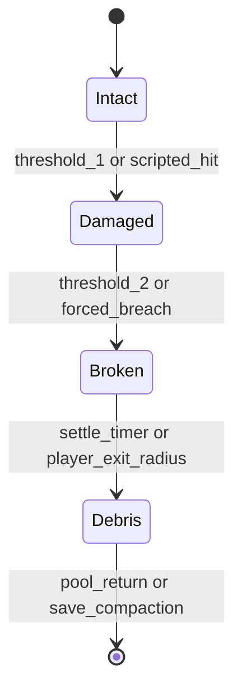

# Genesis Protocol Production-Ready Art and Asset Pipeline

## Executive Summary
This document is the engine-ready art and asset pipeline for **Bitcoin Billionaire's Demonic Haunting: Genesis Protocol**, a third-person action-adventure production package targeting Android/Vulkan while remaining portable to DCC and engine tooling. It defines the complete visual identity, open-world asset plan, destructibility authoring rules, rig and animation contracts, UI/icon/typography standards, craft-tool art specifications, package layout, metadata schema, validation tests, and export bundle process.

Every shippable asset must include concept art, final art, source files, optimized runtime exports, JSON metadata, and a README. Runtime assets are grouped into per-biome bundles and a consolidated import bundle. The pipeline prioritizes silhouette readability, tactile PBR materials, painterly lighting, precomputed fracture data, and stable Android frame pacing.


## Final Genesis Protocol 3D Build Package
The final engine-build contract for Genesis Protocol is `docs/assets/final_3d_engine_package_spec.json`. It supersedes generic open-world placeholders with production 3D specifications for Bel Air Blackout Zone, Irvine Suburbs, Manhattan Consensus, Alpine Cold Storage Bunker, Mojave Ground Return Rail Junction, Dark Pool Dungeons, and Zero-State Relay Towers; playable class characters Cypherpunk, Digital Wraith, Grid Vanguard, and Code Weaver; Ghost Process, Sybil swarm, Dark Pool warden, and Genesis Entity boss phases; skill-cast animation state machines; Genesis-specific craft tools; Merkle Tree and Mnemonic Board UI; and export-ready FBX/GLTF/PNG/TGA/EXR/SVG/JSON metadata contracts. The materialized engine handoff lives in `10_final_3d_engine_package/` and is regenerated with `python3 tools/generate_final_3d_package.py`.

## Complete Engine-Ready 3D Package Index
The canonical machine-readable package for the full 3D deliverable is `docs/assets/complete_3d_asset_package_spec.json`. It enumerates all five full biome world models, 3D blockouts, layered world-model components, heightmap/topography/biome-mask paths, streaming layouts, tileable PBR texture contracts, material definitions, LOD0/LOD1/LOD2 rules, GLTF/FBX export requirements, character rig and animation-ready export contracts, universal destructibility, craft-tool models, UI/icon deliverables, palette rules, accessibility variants, and per-asset metadata paths. Build engineers must treat that JSON as the engine import checklist and this Markdown document as the human-readable style guide.

## 1. Art Direction
### Visual Style
- **Realistic-stylized proportion language:** believable physical scale, simplified large reads, exaggerated hero props, strong negative space around silhouettes.
- **Tactile PBR surfaces:** rough stucco, oxidized metal, dusty quarry stone, damp cavern mineral, wet coastal concrete, cracked glass, fibrous wood.
- **Painterly lighting:** warm key lights, teal bounce, soft rim lights, hand-authored LUTs per biome, fog cards for depth layering.
- **Gritty wonder mood:** haunted crypto infrastructure, analog survival tools, demonic network residue, beautiful decay.

### Six-Color Palette
| Color | Hex | Usage rules |
|---|---:|---|
| Deep Ledger | `#171A1C` | Primary neutral base for menus, night shadows, asphalt, cavern voids, and high-contrast silhouettes. Never use for small body text on dark panels. |
| Ash Concrete | `#6E6A61` | Secondary neutral for masonry, dust, weathered UI panels, inactive controls, and mid-distance terrain blending. |
| Terracotta Signal | `#B65A3C` | Primary accent for hero cloth, traversal markings, destructible weak points, danger paint, and active quest breadcrumbs. |
| Muted Teal | `#3D7F7A` | Complement accent for safe tech, AR scan geometry, forest shadow tint, water reflections, and non-hostile interactive surfaces. |
| Phosphor Gold | `#D6B15E` | Rare/high-value accent for loot, boss weak points, selected UI states, and Merkle progression confirmations. Limit to under 8% of screen area. |
| Cold Bone | `#E7DFC9` | Main readable foreground for body text, parchment codex cards, subtitles, and high-value silhouette rim lighting. |

### Accessibility Variants
- Replace Terracotta Signal danger-only communication with shape language: triangular hazard teeth, pulsing outline, and haptic tick.
- Replace Muted Teal safe-only communication with rounded geometry, check glyphs, and audio confirmation.
- Minimum UI contrast: 4.5:1 for body text, 3:1 for large labels/icons, 7:1 for critical combat warnings.
- Colorblind-safe mode shifts Terracotta Signal to `#C76B4A`, Muted Teal to `#2F8D94`, and Phosphor Gold to `#E0C05F` while preserving luminance separation.

## 2. World Design Pipeline
### Layered Open World
The world is authored as a 6 km x 6 km layered map with five primary biomes and vertical subsurface routes:
1. **Urban District / Irvine-Beige Mainnet:** cul-de-sacs, low stucco, server closets, demonic HOA signage, smart-lock interiors.
2. **Mixed Forest / Recluse Buffer:** pine-oak canopy, abandoned mesh repeaters, root hatches, quiet analog camps.
3. **Quarry / Faraday Scar:** stepped stone bowls, conveyor ruins, dust plumes, exposed data-veins, scaffold puzzles.
4. **Coastal Cliffs / Port Edge:** container yards, switchback cliffs, wet concrete, salt-corroded substations, skiff paths.
5. **Subterranean Caverns / Dark Pool:** mineral tunnels, blackwater pools, phosphor code veins, hidden cold-storage chambers.

### Map Deliverables
- `world_topography_master_8k_EXR_v01.exr`: 16-bit height source, meters scale, Y-up import.
- `world_biomemask_master_8k_PNG_v01.png`: RGBA biome mask where channels isolate coastal, forest, quarry, and urban/cavern influence.
- `world_biomemask_master_8k_INDEX_v01.png`: indexed mask for deterministic procedural placement.
- `world_streaming_grid_JSON_v01.json`: tile coordinates, biome ownership, POIs, traversal tags, memory tier hints.

### POI List
| POI | Biome | Gameplay purpose | Visual landmark |
|---|---|---|---|
| Beige Node Cul-de-Sac | Urban | tutorial stealth/destruction | identical houses broken by terracotta cable veins |
| Null HOA Office | Urban | first locked-door branch | glass cube with ash stucco frame |
| Recluse Camp | Forest | safe hub and season board | teal tarp canopy around analog antenna |
| Root Hatch 12 | Forest | procedural subsurface entrance | bent roots forming a cipher spiral |
| Faraday Forge | Quarry | crafting hub | crane magnet halo and hot terracotta kiln |
| Conveyor Crypt | Quarry | destructible building test | fractured masonry belt tower |
| Container Oracle | Coastal | bazaar and loot cache | stacked containers painted with phosphor sigils |
| Salt Substation | Coastal | metal destruction encounter | arcing teal transformers |
| Blackwater Choir | Cavern | boss arena | reflective pool with bone-white stalactites |
| Zero-State Relay | Cavern/Mountain | endgame relay | vertical server spire vanishing into fog |

### Traversal Routes
- **Golden path:** Urban south gate → forest switchback → quarry lift → coastal road → cavern descent.
- **Analog vehicle route:** wide 6 m dirt/asphalt loop with 12 m turn radius, low prop density, streaming prefetch of two forward tiles.
- **Climb/vault route:** cliff ledges and scaffold edges tagged `traversal_climbable`; ledge thickness 0.35-0.6 m.
- **Subsurface route:** hidden hatches connect forest roots, quarry shafts, coastal drainage, and cavern Dark Pool rooms.

### Procedural Hidden Entrance Rules
```json
{
  "entrance_spawn_rules": {
    "min_distance_from_main_path_m": 18,
    "max_distance_from_poi_m": 80,
    "required_occluder_tags": ["root_cluster", "broken_masonry", "container_shadow", "soil_slump"],
    "scan_reveal_radius_m": 7.5,
    "scan_false_positive_rate": 0.08,
    "minimum_spacing_m": 140,
    "vertical_drop_limit_m": 9,
    "reward_bias": {"craft_materials": 0.45, "lore": 0.25, "shortcut": 0.2, "elite_enemy": 0.1}
  }
}
```

### Per-Biome Asset Requirements
Each biome ships: concept sheet, mood board, 4 tileable PBR material sets, 12 modular meshes, 20 props, 1 sample scene, 1 lighting preset, navmesh tags, occlusion probes, and runtime material definitions.

| Biome | Core materials | Lighting | Streaming layout |
|---|---|---|---|
| Urban | stucco, asphalt, smart glass, copper wire | warm sodium key, teal billboard bounce, hard glass specular | 128 m tiles; interiors stream as subtiles; max 70 MB resident low tier |
| Forest | bark, leaf litter, damp soil, tarp fabric | broken canopy shafts, teal fog, warm camp practicals | 256 m terrain tiles; foliage HLOD clusters; max 64 MB resident low tier |
| Quarry | limestone, gravel, rusted conveyor, dust | high warm sun, volumetric dust, cold shadow pools | 192 m stepped tiles; quarry walls use impostors after 90 m |
| Coastal | wet concrete, salt metal, cliff shale, container paint | overcast sky, terracotta sunset rim, teal water bounce | 192 m tiles; ocean/cliff strip prefetch along route |
| Cavern | blackwater, mineral crust, basalt, phosphor veins | low key, emissive code veins, bone rim | 96 m cells; portals stream one room ahead/behind |

## 3. Destructibility System
### Universal State Machine


### Runtime Contract
- Component fields: `state`, `material_type`, `health`, `fracture_map`, `debris_pool_id`, `loot_table`, `navmesh_delta`, `audio_cue`, `vfx_cue`.
- Large structures use precomputed Voronoi/fracture maps with 3-5 support islands.
- Small objects use pooled debris prefabs: 24 wood chunks, 32 masonry chips, 48 glass shards, 18 metal scraps, 40 leaves, 20 soil clods per active tile.
- Save system stores state deltas only: object id, state, health remainder, loot claimed, navmesh delta hash.

### Material Behaviors
| Material | Damage read | Break behavior | VFX/SFX | Physics |
|---|---|---|---|---|
| Wood | cracks, bent hinges, splinters | anisotropic fracture along grain | splinters, dull thud | light debris, high damping |
| Masonry | dust leaks, chipped edges | chunk fracture plus dust cloud | gravel spray, low rumble | medium debris, sleep quickly |
| Glass | spiderweb cracks | radial shards and glitter | sharp ping, tiny shards | very light, no long simulation |
| Metal | dents, bent seams | hinge tear or panel pop | sparks, groan | heavy chunks, low bounce |
| Foliage | leaf loss, snapped twigs | branch detach and leaf burst | rustle, twig snap | kinematic leaves, cheap particles |
| Soil | slump decals, dust | terrain cut decal plus clods | muffled crumble | pooled clods, no persistent rigidbodies |

### Locked Door Mechanics
- **Lockpick outcome:** plays crouched lockpick animation, consumes time and durability, leaves door intact, grants stealth loot table with higher lore chance.
- **Forced breach outcome:** plays shoulder/kick/tool breach animation, transitions door to broken/debris, alerts NPCs within 25 m, grants faster access and higher scrap chance.

### Physics Budget
- Per destructible event: max 64 active rigidbodies high, 32 mid, 16 low.
- Solver: 4 velocity iterations and 2 position iterations low/mid; 6/3 high.
- Debris lifetime: 8 seconds high, 5 seconds mid, 3 seconds low; then convert to static decals or pooled meshes.
- CPU budget: 2.0 ms high, 1.2 ms mid, 0.7 ms low per destruction burst.

## 4. Characters and Animation
### Hero: Mara Quell, Analog Exorcist
- Signature silhouette: hooded long coat, asymmetric shoulder radio, terracotta sash, teal scan lens, compact tool harness.
- Materials: oiled canvas, scratched ceramic plates, cracked leather, phosphor thread, ash metal buckles.
- Alternate outfits: **Faraday Salvager**, **Recluse Scout**, **Port Runner**, **Cold Storage Ritualist**.

### NPC Archetypes
1. Recluse engineer
2. Port smuggler
3. Quarry foreman
4. HOA zealot
5. Darknet merchant
6. Cold-storage monk
7. Analog mechanic
8. Haunted survivor

### Rig Contract
- 64-bone humanoid skeleton: root, pelvis, spine chain, neck/head, clavicles, arms, hands/fingers, legs/feet/toes, weapon sockets, cloth helper bones.
- Facial blendshapes: blink L/R, brow up/down, smile/frown, jaw open, phonemes A/E/O/U/M, fear, pain, possession glitch.
- LODs: LOD0 60k tris hero / 35k NPC; LOD1 30k / 18k; LOD2 12k / 7k, with baked normal detail.

### Animation Set
- Idle: calm, alert, injured, menu turntable.
- Locomotion: walk/run/sprint, strafe, crouch, stop, pivot, slope adjust.
- Traversal: jump, land, climb, vault, ladder, slide, vehicle mount/dismount.
- Combat: light attack chain, heavy attack, block, parry, dodge, hit reactions, finisher.
- Interaction: pickup, scan, craft, lockpick, push, pull, lever, terminal hack.
- Destruction: hammer strike, pick strike, saw cut, explosive plant, forced breach, debris step-over.
- Death/ragdoll: authored death starts that blend to physics ragdoll over 0.18 seconds.

### NPC Behavior Tree Reactions
- `HearDestruction` → face source → choose investigate/flee/alert allies.
- `SeeForcedBreach` → raise alarm, path around debris, update cover slots.
- `DebrisBlocksPath` → request navmesh semantic update, choose vault if height < 0.8 m, otherwise reroute.
- `GlassBreakNear` → flinch 0.4 s, seek cover, lower accuracy 2 s.
- `FoliageDestroyed` → predators investigate scent/audio marker.

## 5. UI, Icons, and Typography
### UI System
- HUD: health/hashrate bars, tool quick wheel, destructible state reticle, minimap scan pings.
- Inventory: 8-column adaptive grid, rarity frames, PBR material thumbnails, bulk salvage flow.
- Crafting panel: Faraday Forge recipes, Anti-Gravity Studio traversal modules, durability preview, output stat delta.
- Map: streamed tile grid, POIs, hidden entrance uncertainty rings, traversal route filters.
- Tooltips: contextual, 320 dp max width, icon-first labels, color plus shape coding.

### Typography
- Headings: condensed geometric sans, uppercase tracking +2%, weights 600/700.
- Body: humanist sans, sentence case, weights 400/500.
- Minimum sizes: 14 sp body, 16 sp labels, 20 sp panel title, 28 sp screen title.
- Line height: 1.25 heading, 1.45 body; tooltip max two body paragraphs.

### Icon Set
- 24 px design grid, 2 px optical stroke, rounded internal corners, sharp outer silhouettes.
- Export SVG source plus 512x512 PNG per icon, then atlas to `icon_sheet.png` with `icon_atlas.json` coordinates.
- Icon categories: inventory resources, craft tools, destructible states, lock states, subsurface entrances, quest markers, AR scan states.

## 6. Craft Tools
| Tool | Visual concept | VFX/SFX | Animation | Durability |
|---|---|---|---|---|
| Hammer | terracotta-wrapped demolition hammer with teal scanner notch | masonry dust, low impact thud | one/two-handed strikes | loses 1 per hit, extra on metal |
| Pick | quarry pick with Faraday copper inlay | sparks on stone vein, gravel burst | overhead chop, side pry | loses 2 on ore nodes |
| Lockpick | fold-out brass/ceramic pick set | tiny phosphor pulses, soft clicks | crouched two-hand manipulation | chance loss on fail |
| Saw | compact reciprocating saw with analog crank | wood fibers, motor whine | braced cut loop | heat meter controls wear |
| Explosives | taped charges with paper seed seals | terracotta flash, dust ring | plant, arm, roll away | consumed on detonation |
| Scaffold Deployer | backpack launcher unfolds ash-metal lattice | teal hologram preview, metal clack | aim preview, deploy pull | charge-based, recharges at forge |

## 7. Technical Export Requirements
### Formats
- Meshes/animations: FBX ASCII, GLTF 2.0; meters; Y-up; embedded media disabled.
- Textures: base color PNG 16-bit sRGB; normal TGA 16-bit; roughness/metalness packed EXR; height EXR; AO EXR.
- Icons: SVG source, 512x512 PNG, PNG atlas, JSON atlas metadata.
- Metadata: JSON rows validated against required manifest fields.

### Naming Convention
`category_assetname_variant_LOD_version`, for example `prop_wooddoor_locked_LOD0_v01`.

### Asset Metadata Fields
```json
{
  "id": "prop_wooddoor_locked_LOD0_v01",
  "name": "Locked Wood Door",
  "category": "prop",
  "variant": "locked",
  "LOD": "LOD0",
  "version": "v01",
  "formats": ["FBX ASCII", "GLTF 2.0", "PNG", "TGA", "EXR", "JSON"],
  "size_bytes": 7340032,
  "polycount": 2400,
  "texture_resolutions": ["2048x2048"],
  "dependencies": ["vfx_dust_burst_LOD0_v01"],
  "readme_path": "04_props/destructibles/wood/readme.md"
}
```

## 8. Iterative Generation Plan
### Iteration 1: World Layout Pass
- Deliver topography, heightmap, biome masks, POI positions, traversal routes, streaming grid.
- Change notes track biome boundary edits and visibility corridor adjustments.
- Performance impact: estimate resident tile memory and occlusion coverage.
- Checklist: grid loads, route continuity, POI uniqueness, hidden entrance spacing.

### Iteration 2: Hero Concept Pass
- Deliver three silhouettes: **Exorcist Hacker**, **Quarry Salvager**, **Port Nomad**.
- Select Exorcist Hacker for refined turnaround and texture study.
- Performance impact: verify LOD triangle counts, bone count, material slots.
- Checklist: 20 m silhouette read, tool socket clarity, palette adherence, facial blendshape import.

### Iteration 3: Destructible Building Tests
- Deliver sample building, fracture maps, debris pools, lockpick/breach door, physics renders.
- Performance impact: measure rigidbody burst cost and debris pool reuse.
- Checklist: state machine transitions, navmesh delta, save/load persistence, NPC reaction events.

## 9. Validation and Test Cases
- Automated manifest validation: schema fields, IDs, LODs, categories, palette count, non-negative budgets.
- JSON parse validation for all metadata.
- Silhouette tests: grayscale thumbnails at 64 px, 128 px, and 20 m in-engine distance.
- LOD tests: no popping above 8% screen-height delta; crossfade 0.2 s.
- Streaming tests: no missing dependencies when crossing tile borders at sprint and vehicle speed.
- Framerate targets: 30 FPS low Android, 45 FPS mid, 60 FPS high; destruction bursts may not exceed two consecutive over-budget frames.

## 10. Export Bundle Procedure
1. Validate JSON: `python3 -m json.tool assets/manifest/asset_manifest.json`.
2. Validate manifest semantics: `python3 tools/validate_asset_manifest.py assets/manifest/asset_manifest.json`.
3. Build deterministic package: `python3 tools/package_assets.py --src . --out build/genesis_asset_export.zip`.
4. Import zip into engine asset staging and verify per-biome sample scenes.
5. Promote bundle only when destruction lab and all biome scenes pass target device checks.

## 11. Folder Structure
The canonical folder structure is rooted in this repository and mirrored inside export zips. Per-asset README files explain gameplay usage, material channel assumptions, dependencies, LOD coverage, and test-scene ownership.

## 12. Production Ownership Matrix
| Domain | Owner | Required review |
|---|---|---|
| Style guide | Art director | accessibility and lore consistency |
| World/biomes | Environment lead | streaming/performance review |
| Destructibles | Tech art lead | physics and navmesh review |
| Characters | Character lead | rig/animation review |
| UI/icons | UI art lead | contrast/responsive review |
| Tools/VFX/audio refs | Gameplay art lead | readability and feedback review |
| Manifest/package | Build engineer | deterministic CI validation |
